# WebSocket Single-Connection Mode Flow

## Complete Data Flow Diagram

```mermaid
flowchart TD
    Start([Application Startup]) --> Init[MarketDataService.__init__]

    Init --> CreateAdapter[Create RealTimeDataAdapter]
    CreateAdapter --> CheckMode{USE_MULTI_CONNECTION?}

    CheckMode -->|false| CreateSingle[Create MassiveWebSocketClient]
    CreateSingle --> Ready[Adapter Ready]

    Ready --> ServiceLoop[MarketDataService._service_loop]
    ServiceLoop --> GetUniverse[_get_universe]

    GetUniverse --> LoadKey[Read SYMBOL_UNIVERSE_KEY<br/>from .env]
    LoadKey --> CacheControl[CacheControl.get_universe_tickers<br/>universe_key]
    CacheControl --> DBQuery[(Query cache_entries table)]
    DBQuery --> TickerList[Return ticker list<br/>e.g., 70 tickers]

    TickerList --> Connect[adapter.connect universe]
    Connect --> ClientConnect[MassiveWebSocketClient.connect]

    ClientConnect --> WSApp[Create WebSocketApp<br/>wss://socket.massive.com/stocks]
    WSApp --> Thread[Start daemon thread<br/>ws.run_forever]

    Thread --> OnOpen[WebSocket _on_open callback]
    OnOpen --> SendAuth[Send auth message<br/>action: auth, params: API_KEY]

    SendAuth --> OnMsg1[WebSocket _on_message callback]
    OnMsg1 --> CheckAuth{Auth successful?}
    CheckAuth -->|Yes| Subscribe[client.subscribe tickers]
    CheckAuth -->|No| AuthFail[Log error & timeout]

    Subscribe --> SendSub[Send subscribe message<br/>action: subscribe<br/>params: A.AAPL,A.NVDA,...]
    SendSub --> Listening[WebSocket listening for data]

    Listening --> TickReceived[Massive API sends tick data]
    TickReceived --> OnMsg2[WebSocket _on_message callback]

    OnMsg2 --> ParseJSON[Parse JSON message]
    ParseJSON --> CheckType{Message type?}

    CheckType -->|A event| ParseTick[Parse per-second aggregate<br/>sym, o, h, l, c, v, t]
    CheckType -->|status| LogStatus[Log status message]
    CheckType -->|Other| LogOther[Log unknown type]

    ParseTick --> CreateTickData[Create TickData object<br/>ticker, price, volume, timestamp]
    CreateTickData --> Callback[Call on_tick_callback<br/>MarketDataService._handle_tick_data]

    Callback --> UpdateStats[Update service stats<br/>ticks_processed++]
    UpdateStats --> FallbackDetector[Feed to fallback_pattern_detector<br/>if active]

    FallbackDetector --> PublishWS[DataPublisher.publish_tick_data<br/>WebSocket to browsers]
    PublishWS --> WSClients[Connected browser clients<br/>receive real-time updates]

    PublishWS --> PublishRedis1[Publish to Redis<br/>tickstock.data.raw]
    PublishRedis1 --> PublishRedis2[Publish to Redis<br/>tickstock:market:ticks]

    PublishRedis2 --> TickStockPL[TickStockPL consumes<br/>for OHLCV aggregation]

    TickStockPL --> PatternDetection[Pattern detection &<br/>indicator calculation]
    PatternDetection --> RedisEvents[Publish events to Redis<br/>tickstock.events.patterns]

    RedisEvents --> AppConsumes[TickStockAppV2 consumes<br/>pattern events]

    LogStatus --> Listening
    LogOther --> Listening
    WSClients --> Listening

    style Start fill:#e1f5ff
    style CreateSingle fill:#ffe1e1
    style TickerList fill:#e1ffe1
    style WSApp fill:#fff4e1
    style Listening fill:#f0e1ff
    style CreateTickData fill:#e1ffe1
    style PublishWS fill:#ffe1f5
    style TickStockPL fill:#e1f5ff
```



## Key Components

### 1. Initialization Phase
- **MarketDataService** creates **RealTimeDataAdapter**
- **RealTimeDataAdapter** checks `USE_MULTI_CONNECTION=false`
- Creates single **MassiveWebSocketClient** instance

### 2. Universe Loading Phase
- `_get_universe()` reads `SYMBOL_UNIVERSE_KEY` from .env
- `CacheControl.get_universe_tickers()` queries `cache_entries` table
- Returns ticker list (e.g., 70 tickers from `stock_etf_test:combo_test`)

### 3. Connection Phase
- `MassiveWebSocketClient.connect()` creates `WebSocketApp`
- Opens WebSocket connection to `wss://socket.massive.com/stocks`
- Runs in daemon thread with `run_forever()`

### 4. Authentication Phase
- `_on_open()` callback sends auth message
- `_on_message()` receives auth response
- On success, calls `subscribe()` with ticker list

### 5. Subscription Phase
- Formats tickers as per-second aggregates: `A.AAPL,A.NVDA,...`
- Sends subscribe message to Massive API
- WebSocket enters listening state

### 6. Data Reception Phase
- Massive API sends tick data (per-second OHLC bars)
- `_on_message()` callback parses JSON
- Creates `TickData` object with ticker, price, volume, timestamp

### 7. Data Distribution Phase
- Calls `on_tick_callback` → `MarketDataService._handle_tick_data()`
- **Branch 1**: Publishes to WebSocket clients (browser UI updates)
- **Branch 2**: Publishes to Redis `tickstock.data.raw`
- **Branch 3**: Publishes to Redis `tickstock:market:ticks` (TickStockPL forwarding)

### 8. Integration Phase
- **TickStockPL** consumes ticks from Redis
- Aggregates into OHLCV bars
- Detects patterns and calculates indicators
- Publishes events back to Redis `tickstock.events.patterns`
- **TickStockAppV2** consumes pattern events for UI display

## Configuration Requirements

```bash
# .env for single-connection mode
USE_MASSIVE_API=true
MASSIVE_API_KEY=your_api_key_here
USE_MULTI_CONNECTION=false

# Symbol source (NOT WEBSOCKET_CONNECTION_1_SYMBOLS)
SYMBOL_UNIVERSE_KEY=stock_etf_test:combo_test
```

## Key Files

| File | Role |
|------|------|
| `src/core/services/market_data_service.py` | Orchestrates data flow, universe loading |
| `src/infrastructure/data_sources/adapters/realtime_adapter.py` | Adapter initialization, mode selection |
| `src/presentation/websocket/massive_client.py` | WebSocket connection, auth, subscription |
| `src/infrastructure/cache/cache_control.py` | Universe loading from database |
| `src/presentation/websocket/data_publisher.py` | WebSocket broadcasting to browsers |

## Data Format Examples

### Incoming Massive API Message (Per-Second Aggregate)
```json
{
  "ev": "A",
  "sym": "AAPL",
  "o": 150.25,
  "h": 150.50,
  "l": 150.20,
  "c": 150.45,
  "v": 12500,
  "t": 1732454400000
}
```

### TickData Object
```python
TickData(
    ticker="AAPL",
    price=150.45,
    volume=12500,
    timestamp=1732454400000,
    event_type="aggregate",
    source="massive",
    tick_open=150.25,
    tick_high=150.50,
    tick_low=150.20,
    tick_close=150.45,
    tick_volume=12500
)
```

### Redis Message (tickstock:market:ticks)
```json
{
  "ticker": "AAPL",
  "price": 150.45,
  "volume": 12500,
  "timestamp": 1732454400000,
  "event_type": "aggregate",
  "source": "massive",
  "tick_open": 150.25,
  "tick_high": 150.50,
  "tick_low": 150.20,
  "tick_close": 150.45,
  "tick_volume": 12500
}
```

## Performance Characteristics

| Metric | Target | Notes |
|--------|--------|-------|
| WebSocket Delivery | <100ms | From Massive API to browser clients |
| Redis Publish | <10ms | Forwarding to TickStockPL |
| Tick Processing | <1ms | Per tick handled |
| Max Tickers | ~100 | Single connection limit |

## Error Handling

- **Connection Timeout**: 15 second timeout if `_on_open` doesn't fire
- **Auth Failure**: Logs error and connection fails
- **Parse Errors**: Logged but don't stop message processing
- **Callback Exceptions**: Caught and logged in `_handle_tick_data()`

## Related Documentation

- [WebSockets Integration Overview](../websockets-integration.md)
- [Multi-Connection Mode](../websockets-integration.md#multi-connection-mode-optional)
- [Redis Integration](redis-integration.md)
