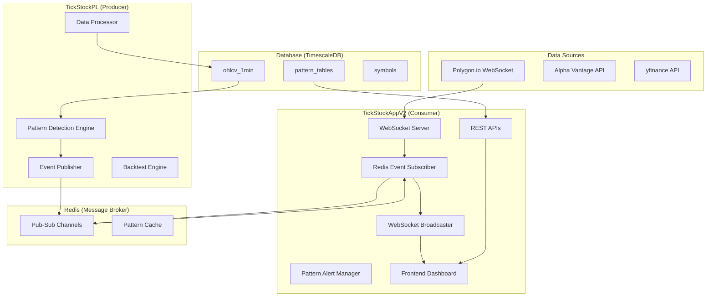

# TickStock Pattern Processing Flow & Integration Architecture

**Created**: September 15, 2025
**Purpose**: Comprehensive documentation of pattern detection, processing, and event flow between TickStockPL and TickStockAppV2

## Executive Summary

The TickStock ecosystem consists of two primary systems operating in a producer-consumer pattern:
- **TickStockPL** (Producer): Heavy analytical engine for pattern detection and data processing
- **TickStockAppV2** (Consumer): UI application for event consumption and user interaction

Communication occurs exclusively through Redis pub-sub channels, ensuring loose coupling and system independence.

## System Architecture Overview



## Detailed Processing Flow

### Phase 1: Data Ingestion
```
1. Market Data Sources → TickStockAppV2
   - Polygon.io WebSocket (primary, real-time)
   - Alpha Vantage REST API (backup, batch)
   - yfinance (development/testing)

2. TickStockAppV2 → Redis
   Channel: tickstock.data.raw
   Format: Raw tick/OHLCV data

3. Redis → TickStockPL
   TickStockPL subscribes to raw data channel
   Processes into StandardOHLCV format
```

### Phase 2: Pattern Detection (TickStockPL)

#### 2.1 Data Processing Pipeline
```python
Raw Data → StandardOHLCV Conversion → TimescaleDB Storage → Pattern Detection
```

#### 2.2 Pattern Detection Triggers
- **Scheduled Scans**: Every 60 seconds for active symbols
- **Event-Driven**: On significant price/volume changes
- **User-Triggered**: Via backtest job requests

#### 2.3 Pattern Types & Indicators

**Technical Patterns** (11 Core Patterns):
- Candlestick: Doji, Hammer, Shooting Star
- Multi-bar: Engulfing, Harami, Morning/Evening Star
- Trend: Three White Soldiers, Three Black Crows
- Reversal: Piercing Line, Dark Cloud Cover

**Custom Indicators** (Sprint 25 Additions):
- Volume_Spike: 2x average volume detection
- Support_Test: Price approaching support levels
- Resistance_Break: Breaking through resistance
- Momentum_Shift: RSI/MACD divergence

#### 2.4 Pattern Event Structure
```json
{
    "event_type": "pattern_detected",
    "source": "TickStockPL",
    "timestamp": 1234567890.123,
    "data": {
        "symbol": "AAPL",
        "pattern": "Hammer",           // Pattern name
        "pattern_type": "Hammer",      // Alternate field
        "confidence": 0.85,             // 0.0 to 1.0
        "current_price": 185.50,
        "price_change": 2.3,            // Percentage
        "timestamp": 1234567890.123,
        "expires_at": 1234571490.123,   // TTL for alert
        "indicators": {
            "relative_strength": 1.5,
            "relative_volume": 2.0,
            "rsi": 65.0
        },
        "source": "daily",              // Tier: daily/intraday/combo
        "tier": "daily"                 // Redundant field for compatibility
    }
}
```

### Phase 3: Event Publishing (TickStockPL → Redis)

#### Redis Channels
```
Primary Channel:
- tickstock.events.patterns          # All pattern events

Tier-Specific Channels:
- tickstock.events.patterns.daily    # Daily timeframe patterns
- tickstock.events.patterns.intraday # Intraday patterns
- tickstock.events.patterns.combo    # Combined analysis

Special Events:
- tickstock.events.backtesting.progress
- tickstock.events.backtesting.results
- tickstock.health.status
```

### Phase 4: Event Consumption (TickStockAppV2)

#### 4.1 Redis Event Subscriber
```python
# src/core/services/redis_event_subscriber.py
class RedisEventSubscriber:
    channels = {
        'tickstock.events.patterns': EventType.PATTERN_DETECTED,
        'tickstock.events.backtesting.progress': EventType.BACKTEST_PROGRESS,
        'tickstock.events.backtesting.results': EventType.BACKTEST_RESULT,
        'tickstock.health.status': EventType.SYSTEM_HEALTH
    }

    def _handle_pattern_event(self, event):
        # Extract nested data structure
        pattern_data = event.data.get('data', event.data)

        # Pattern filtering based on user preferences
        interested_users = pattern_alert_manager.get_users_for_alert(
            pattern_name, symbol, confidence
        )

        # Forward to WebSocket broadcaster
        websocket_broadcaster.broadcast_pattern_alert(event)
```

#### 4.2 WebSocket Broadcasting
```python
# src/core/services/websocket_broadcaster.py
class WebSocketBroadcaster:
    def broadcast_pattern_alert(self, pattern_event):
        # Handle both nested and flat structures
        event_data = pattern_event.get('data', pattern_event)

        # Extract pattern info
        pattern_name = pattern_data.get('pattern') or pattern_data.get('pattern_type')

        # Find subscribed users
        for session_id, user in self.connected_users.items():
            if pattern_name in user.subscriptions:
                self.socketio.emit('pattern_alert', websocket_message, room=session_id)
```

#### 4.3 Frontend Reception
```javascript
// static/js/services/tier_pattern_service.js
socket.on('pattern_alert', (data) => {
    // Update dashboard tables
    updatePatternTable(data.pattern, data.symbol, data.confidence);

    // Show browser notification for high confidence
    if (data.confidence >= 0.9) {
        showBrowserNotification(data);
    }

    // Update charts if symbol is displayed
    if (isSymbolDisplayed(data.symbol)) {
        addPatternMarker(data);
    }
});
```

### Phase 5: User Interaction & Feedback Loop

#### 5.1 User-Triggered Actions
```
User Action → TickStockAppV2 → Redis → TickStockPL
```

**Backtest Request**:
```json
Channel: tickstock.jobs.backtest
{
    "job_id": "uuid",
    "user_id": "user123",
    "symbols": ["AAPL", "GOOGL"],
    "patterns": ["Hammer", "Doji"],
    "date_range": {"start": "2024-01-01", "end": "2024-12-31"},
    "parameters": {...}
}
```

**Pattern Subscription**:
```json
Channel: tickstock.jobs.alerts
{
    "user_id": "user123",
    "action": "subscribe",
    "patterns": ["Breakout", "Support_Test"],
    "confidence_threshold": 0.7,
    "symbols": ["AAPL", "TSLA"]
}
```

## Performance Requirements & SLAs

### Latency Targets
- **Pattern Detection**: <100ms from data arrival
- **Redis Publishing**: <10ms
- **Event Consumption**: <50ms
- **WebSocket Delivery**: <100ms end-to-end
- **Total Pipeline**: <250ms from market data to UI

### Throughput Capabilities
- **Concurrent Symbols**: 4,000+ active tickers
- **Pattern Scans**: 60-second intervals
- **Events/Second**: 1,000+ pattern events
- **Connected Users**: 10,000+ WebSocket connections

### Reliability Metrics
- **Event Loss**: Zero (guaranteed by Pull Model)
- **Uptime Target**: 99.9% availability
- **Failover Time**: <30 seconds
- **Data Persistence**: 7-day event history

## Database Schema

### Pattern Storage Tables
```sql
-- Daily patterns (TickStockPL writes, TickStockAppV2 reads)
CREATE TABLE daily_patterns (
    id SERIAL PRIMARY KEY,
    symbol VARCHAR(10),
    pattern_type VARCHAR(50),
    confidence DECIMAL(3,2),
    detection_timestamp TIMESTAMPTZ,
    price_at_detection DECIMAL(10,2),
    volume_at_detection BIGINT,
    indicators JSONB,
    expires_at TIMESTAMPTZ
);

-- Intraday patterns
CREATE TABLE intraday_patterns (
    -- Similar structure
);

-- Pattern performance tracking
CREATE TABLE pattern_performance (
    pattern_type VARCHAR(50),
    success_rate DECIMAL(3,2),
    avg_return DECIMAL(5,2),
    sample_size INT,
    last_updated TIMESTAMPTZ
);
```

## Error Handling & Recovery

### Common Issues & Solutions

#### 1. Pattern Event Structure Mismatch
**Issue**: Nested vs flat data structure
**Solution**: TickStockAppV2 handles both:
```python
event_data = pattern_event.get('data', pattern_event)
if isinstance(event_data, dict) and 'data' in event_data:
    pattern_data = event_data['data']  # Nested
else:
    pattern_data = event_data  # Flat
```

#### 2. Redis Connection Loss
**Issue**: Temporary network interruption
**Solution**: Automatic reconnection with exponential backoff
```python
for attempt in range(3):
    time.sleep(2 ** attempt)
    if self._test_redis_connection():
        return
```

#### 3. Missing Pattern Fields
**Issue**: Pattern events missing required fields
**Solution**: Field validation with fallbacks
```python
pattern_name = pattern_data.get('pattern') or pattern_data.get('pattern_type')
if not pattern_name:
    logger.warning('Pattern event missing pattern name')
    return
```

## Monitoring & Observability

### Key Metrics to Track
1. **Pattern Detection Rate**: Patterns detected per minute
2. **Event Latency**: Time from detection to UI delivery
3. **Cache Hit Ratio**: Redis pattern cache effectiveness
4. **WebSocket Connections**: Active user connections
5. **Error Rate**: Failed events per hour

### Health Check Endpoints
- `GET /health` - Overall system health
- `GET /api/pattern-discovery/health` - Pattern service status
- `GET /api/redis/status` - Redis connectivity
- `GET /api/websocket/stats` - WebSocket statistics

## Testing & Validation

### Test Pattern Generation
```python
# scripts/test_pattern_event.py
test_event = {
    'event_type': 'pattern_detected',
    'data': {
        'symbol': 'TEST',
        'pattern': 'TestPattern',
        'confidence': 0.85,
        'current_price': 100.50,
        'price_change': 2.5,
        'timestamp': time.time(),
        'expires_at': time.time() + 3600,
        'indicators': {
            'relative_strength': 1.5,
            'relative_volume': 2.0,
            'rsi': 65.0
        },
        'source': 'test'
    }
}
redis_client.publish('tickstock.events.patterns', json.dumps(test_event))
```

### System Health Test
```bash
python scripts/test_system_health.py
```

## Future Enhancements

### Planned Improvements (Sprint 26-30)
1. **Machine Learning Integration**: Pattern confidence scoring using ML models
2. **Complex Event Processing**: Multi-pattern correlation detection
3. **Predictive Analytics**: Forward-looking pattern success probability
4. **Custom Pattern Builder**: User-defined pattern creation interface
5. **Pattern Backtesting UI**: Visual backtesting with performance metrics

### Scalability Roadmap
1. **Horizontal Scaling**: Multiple TickStockPL instances with load balancing
2. **Event Streaming**: Apache Kafka for high-volume event processing
3. **Distributed Cache**: Redis Cluster for pattern cache scaling
4. **Edge Computing**: Pattern detection at market data source

## Conclusion

The TickStock pattern processing architecture provides a robust, scalable foundation for real-time market pattern detection and delivery. The loose coupling via Redis pub-sub ensures system independence while maintaining sub-second latency from market data to user notification.

**Key Success Factors**:
- Clear separation of concerns (Producer/Consumer)
- Event-driven architecture with guaranteed delivery
- Multiple fallback mechanisms for reliability
- Comprehensive monitoring and health checks
- Performance-optimized at every layer