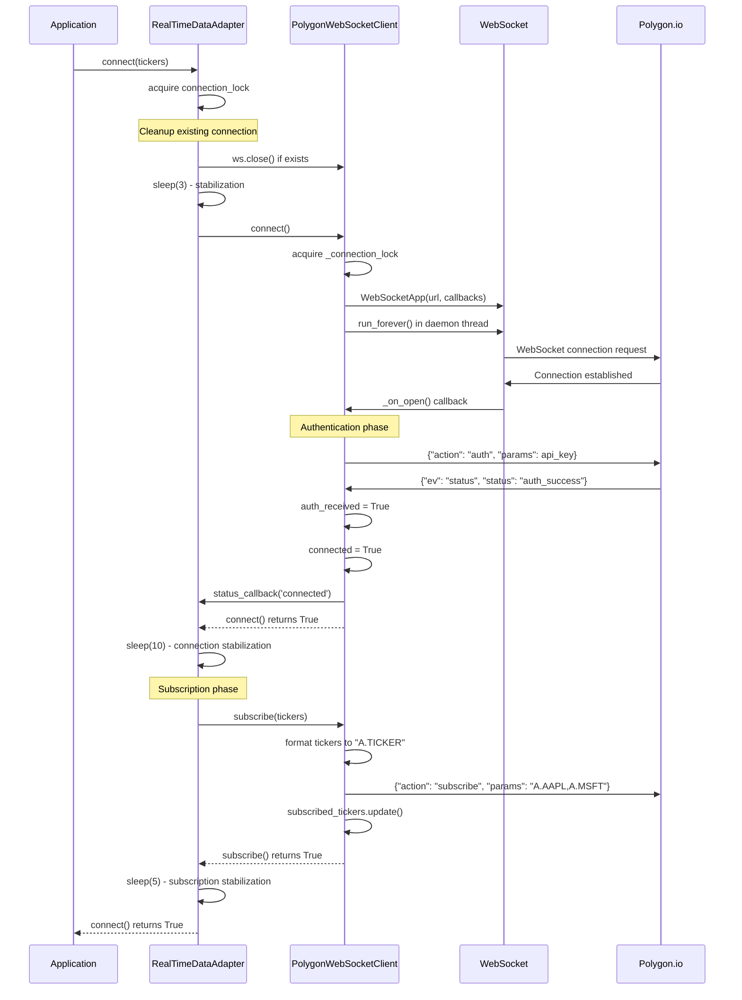
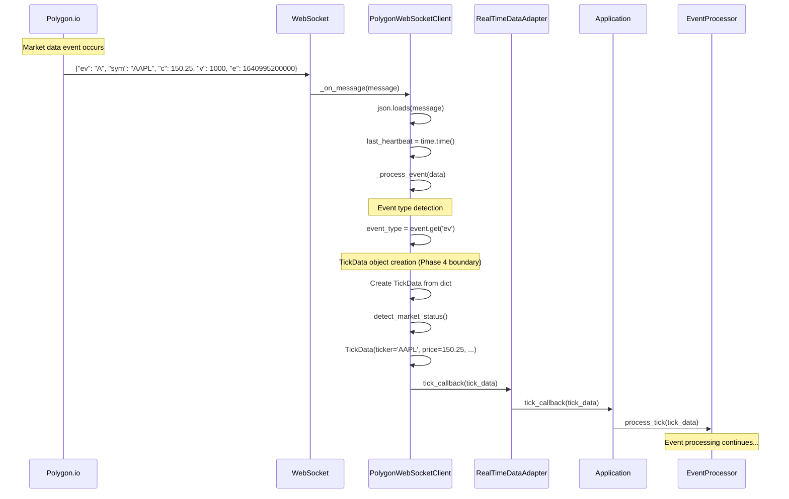
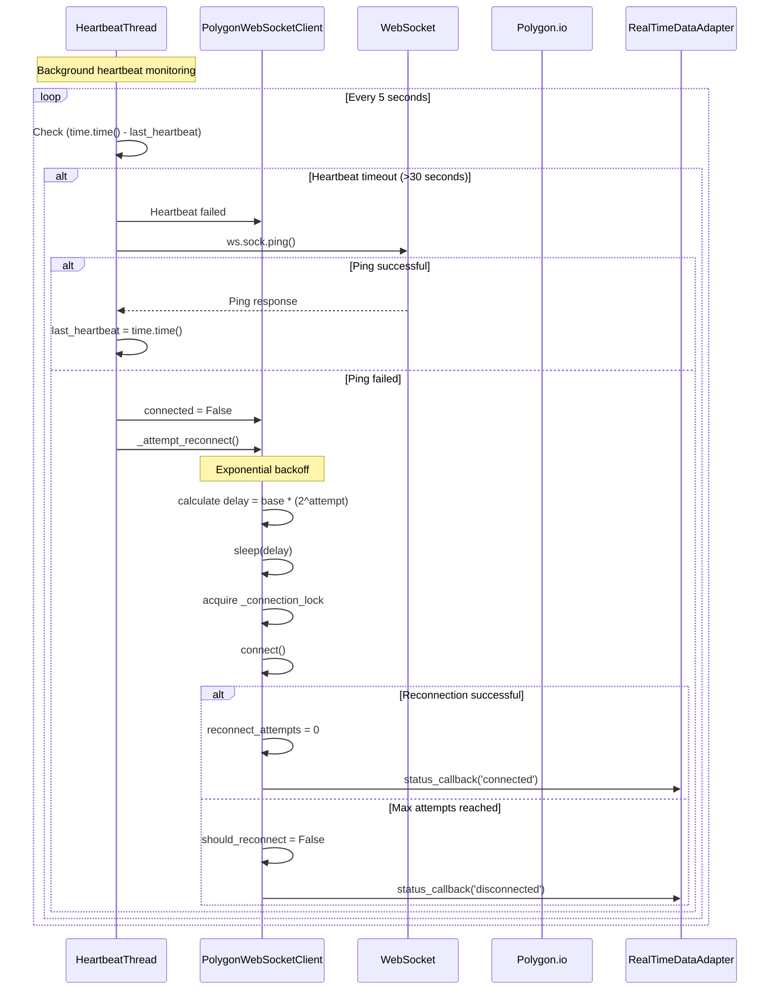
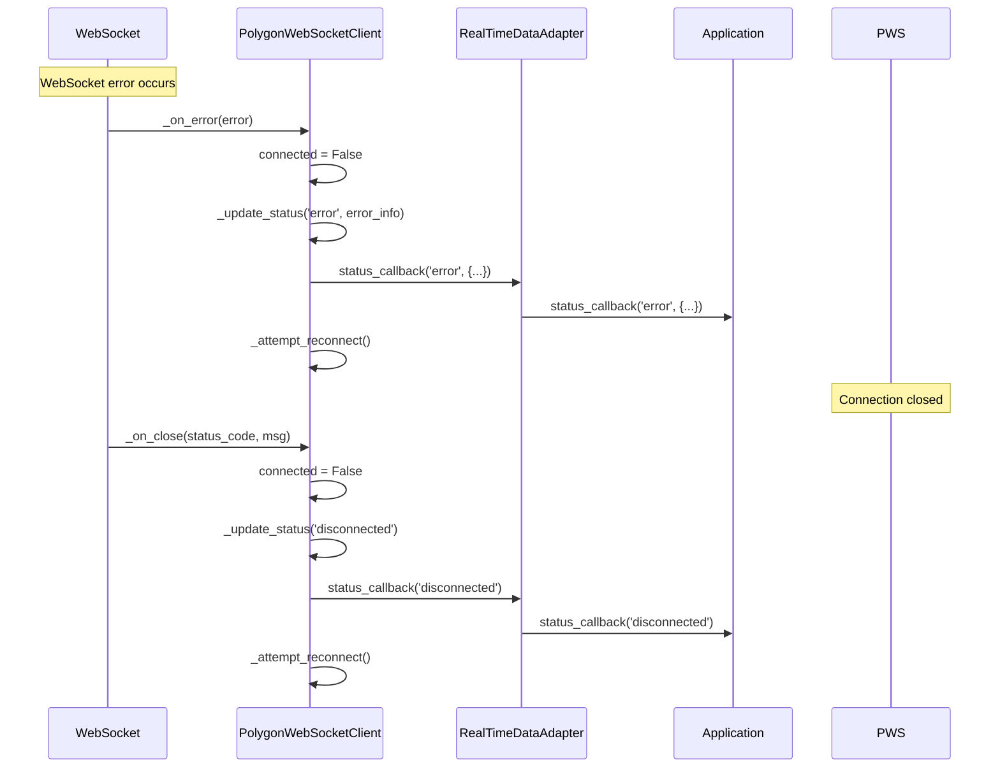
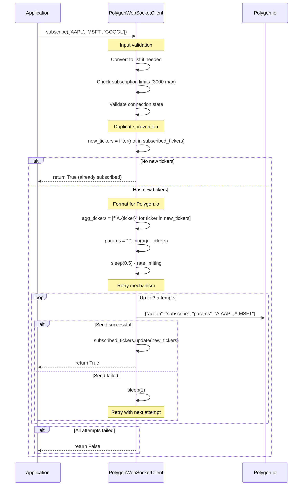

# WebSocket Architecture Documentation

## Overview

The TickStock WebSocket architecture provides real-time market data streaming from Polygon.io via WebSocket connections. The system is designed for high-performance, sub-millisecond event processing with robust connection management and automatic reconnection capabilities.

## PolygonWebSocketClient Class Structure

### Singleton Pattern Implementation

```python
class PolygonWebSocketClient:
    _instance = None
    _initialized = False

    def __new__(cls, *args, **kwargs):
        if cls._instance is None:
            cls._instance = super(PolygonWebSocketClient, cls).__new__(cls)
            cls._instance._initialized = False
        return cls._instance
```

**Key Characteristics:**
- Thread-safe singleton ensuring single WebSocket connection per application instance
- Prevents multiple concurrent connections to Polygon.io
- Maintains state across multiple instantiation attempts
- Re-initialization support for callback updates without reconnection

### Connection Lifecycle Management

#### Initialization Phase
```python
def __init__(self, api_key, on_tick_callback=None, on_status_callback=None, config=None):
```

**Configuration Parameters:**
- `POLYGON_WEBSOCKET_RECONNECT_DELAY`: Base reconnection delay (default: 5s)
- `POLYGON_WEBSOCKET_MAX_RECONNECT_DELAY`: Maximum reconnection delay (default: 60s)
- `POLYGON_WEBSOCKET_MAX_RETRIES`: Maximum retry attempts (default: 5)

**State Variables:**
- `connected`: Boolean connection status
- `should_reconnect`: Reconnection control flag
- `auth_received`: Authentication confirmation status
- `subscribed_tickers`: Set of currently subscribed tickers
- `reconnect_attempts`: Current reconnection attempt counter
- `last_heartbeat`: Timestamp of last received message

#### Connection Establishment
```python
def connect(self):
    """Establish WebSocket connection with improved lifecycle management"""
```

**Connection Process:**
1. **Thread-safe connection management** using `_connection_lock`
2. **Existing connection cleanup** before establishing new connection
3. **WebSocketApp creation** with callback handlers
4. **Background thread startup** with ping/pong support
5. **Connection timeout handling** (15-second timeout)
6. **Authentication wait cycle** with status monitoring

**Connection State Validation:**
```python
if self.ws and self.ws.sock and self.ws.sock.connected and self.connected:
    logger.info("WebSocket already connected, skipping reconnection")
    return True
```

#### Authentication Flow
```python
def _on_open(self, ws):
    """Handle WebSocket open event with improved connection management"""
```

**Authentication Process:**
1. **Authentication message transmission**: `{"action": "auth", "params": self.api_key}`
2. **Timeout-based confirmation**: 10-second authentication window
3. **Success confirmation**: Wait for `auth_success` status message
4. **Connection state update**: Set `connected = True` after authentication

### Heartbeat and Health Monitoring

#### Heartbeat System
```python
def _heartbeat_checker(self):
    """Background thread for connection health monitoring"""
```

**Health Monitoring Features:**
- **Heartbeat interval**: 30-second message timeout detection
- **Ping mechanism**: Active socket ping when no messages received
- **Automatic recovery**: Reconnection trigger on heartbeat failure
- **Background thread**: Daemon thread for continuous monitoring

**Health Check Logic:**
```python
if self.connected and (time.time() - self.last_heartbeat) > self.heartbeat_interval:
    if self.ws and self.ws.sock:
        self.ws.sock.ping()
        self.last_heartbeat = time.time()
```

### Reconnection Logic with Exponential Backoff

#### Automatic Reconnection
```python
def _attempt_reconnect(self):
    """Exponential backoff reconnection strategy"""
```

**Reconnection Strategy:**
- **Exponential backoff**: `delay = min(base_delay * (2^(attempt-1)), max_delay)`
- **Maximum attempts**: Configurable retry limit (default: 5 attempts)
- **Thread-safe reconnection**: Connection lock prevents concurrent reconnections
- **State reset**: Clean authentication and connection state on successful reconnection

**Backoff Calculation:**
```python
delay = min(self.base_reconnect_delay * (2 ** (self.reconnect_attempts - 1)), self.max_reconnect_delay)
```

### Event Processing Pipeline

#### Message Processing Flow
```python
def _on_message(self, ws, message):
    """Process incoming WebSocket messages"""
```

**Processing Steps:**
1. **JSON deserialization**: Parse incoming message string
2. **Heartbeat update**: Update last message timestamp
3. **Message type detection**: Handle arrays vs single messages
4. **Event routing**: Route to appropriate event processors

#### Event Type Boundary (Phase 4 Compliance)
```python
def _process_event(self, event):
    """External boundary: Convert dict data to typed TickData objects"""
```

**Supported Event Types:**
- **'A' - Aggregate Bars**: Per-second/minute aggregated data
- **'T' - Trades**: Individual trade executions  
- **'Q' - Quotes**: Bid/ask quote updates
- **'status'**: Connection and authentication status

**Type Conversion Process:**
```python
# PHASE 4: Create typed TickData object from external dict data
tick_data = TickData(
    ticker=event.get('sym'),
    price=event.get('c'),  # Close price for aggregates
    volume=event.get('v', 0),
    timestamp=event.get('e', 0) / 1000.0,  # Convert ms to seconds
    source='polygon',
    event_type=event_type
)
```

### Subscription Management

#### Ticker Subscription
```python
def subscribe(self, tickers):
    """Subscribe to ticker events with connection state validation"""
```

**Subscription Features:**
- **Connection validation**: Ensure WebSocket is connected before subscription
- **Duplicate prevention**: Track subscribed tickers to prevent re-subscription
- **Batch processing**: Handle single ticker or ticker lists
- **Subscription limits**: 3000 ticker maximum per connection
- **Retry mechanism**: 3-attempt subscription with 1-second delays
- **Format conversion**: Convert tickers to Polygon aggregate format (`A.{ticker}`)

**Subscription Message Format:**
```json
{
    "action": "subscribe",
    "params": "A.AAPL,A.MSFT,A.GOOGL"
}
```

### Error Handling and Status Callbacks

#### Error Handling Strategy
```python
def _on_error(self, ws, error):
    """WebSocket error handler with automatic recovery"""
```

**Error Response:**
1. **Error logging**: Detailed error information capture
2. **Connection state reset**: Set `connected = False`
3. **Status callback notification**: Inform application of error state
4. **Automatic reconnection**: Trigger reconnection attempt

#### Status Callback System
```python
def _update_status(self, status: str, extra_info: Optional[Dict] = None):
    """Centralized status update system"""
```

**Status Types:**
- `'connected'`: Successful connection and authentication
- `'disconnected'`: Connection closed or lost
- `'error'`: WebSocket or processing errors
- `'status_update'`: Polygon.io status messages

### Thread Safety and Concurrency

#### Thread Management
- **Connection thread**: Dedicated thread for WebSocket event loop
- **Heartbeat thread**: Background daemon for health monitoring
- **Connection lock**: Mutex for connection state changes
- **Callback isolation**: Error handling prevents callback failures from affecting WebSocket

#### Concurrent Access Protection
```python
with self._connection_lock:
    # Thread-safe connection operations
    if self.connect():
        self.reconnect_attempts = 0
```

## Performance Characteristics

### Memory Management
- **Singleton pattern**: Single instance reduces memory overhead
- **Event streaming**: No buffering of historical data
- **Connection reuse**: Persistent connection minimizes setup overhead

### Latency Optimization
- **Skip UTF-8 validation**: Performance optimization for high-frequency data
- **Ping intervals**: 30-second ping, 10-second timeout
- **Direct callback**: Immediate event processing without queuing

### Scalability Limits
- **3000 ticker maximum**: Polygon.io WebSocket subscription limit
- **Single connection**: One WebSocket per application instance
- **Thread overhead**: Two additional threads per client instance

## Integration Points

### Callback Interface
```python
# Tick data callback - receives typed TickData objects
def on_tick_callback(self, tick_data: TickData) -> None:
    pass

# Status callback - receives connection status updates
def on_status_callback(self, status: str, extra_info: Optional[Dict] = None) -> None:
    pass
```

### Configuration Integration
```python
# Environment-based configuration
self.reconnect_delay = self.config.get('POLYGON_WEBSOCKET_RECONNECT_DELAY', 5)
self.max_reconnect_delay = self.config.get('POLYGON_WEBSOCKET_MAX_RECONNECT_DELAY', 60)
self.max_retries = self.config.get('POLYGON_WEBSOCKET_MAX_RETRIES', 5)
```

## Future Multi-Frequency Considerations

### Current Limitations
- **Per-second aggregates only**: Hardcoded to 'A.*' subscription format
- **Single subscription type**: No support for multiple frequencies per ticker
- **Static configuration**: No runtime frequency changes

### Extension Points for Sprint 101
- **Subscription format flexibility**: Support for different aggregate intervals
- **Multiple connection support**: Per-frequency WebSocket connections
- **Configuration-driven subscriptions**: JSON-based subscription management
- **Stream isolation**: Separate processing pipelines per frequency

## WebSocket Subscription Management and Ticker Handling

### Subscription Architecture

#### Subscription State Management
```python
self.subscribed_tickers = set()  # Track currently subscribed tickers
MAX_SUBSCRIPTIONS = 3000        # Polygon.io WebSocket limit
```

**Key Features:**
- **Set-based tracking**: O(1) lookup for duplicate prevention
- **Subscription limit enforcement**: 3000 ticker maximum per connection
- **Persistence across reconnections**: Subscribed tickers maintained during reconnects
- **Thread-safe operations**: Subscription state protected by connection lifecycle

#### Subscription Request Processing
```python
def subscribe(self, tickers):
    """Subscribe to ticker events with improved handling of connection state"""
```

**Input Validation:**
```python
if not isinstance(tickers, list):
    tickers = [tickers]  # Normalize single ticker to list

if not tickers:
    logger.debug("No tickers to subscribe to")
    return True
```

**Subscription Limit Validation:**
```python
if len(self.subscribed_tickers) + len(tickers) > MAX_SUBSCRIPTIONS:
    logger.warning(f"Subscription limit reached: {len(self.subscribed_tickers)} current + {len(tickers)} requested exceeds {MAX_SUBSCRIPTIONS}")
    return False
```

**Connection State Validation:**
```python
if not self.connected or not self.ws or not hasattr(self.ws, 'sock') or not self.ws.sock:
    logger.warning("Cannot subscribe - not connected to WebSocket")
    return False
```

### Ticker Format Conversion

#### Polygon.io Aggregate Format
```python
# Format tickers for per-second aggregates (A.*)
agg_tickers = [f"A.{ticker}" for ticker in new_tickers]
agg_list = ",".join(agg_tickers)
```

**Format Specifications:**
- **Aggregate prefix**: All subscriptions use 'A.' prefix for aggregate data
- **Comma-separated**: Multiple tickers joined in single subscription message
- **Per-second frequency**: Hardcoded to per-second aggregates (A.*)
- **Ticker normalization**: Input tickers converted to uppercase (handled by Polygon.io)

**Example Conversion:**
```python
Input:  ["AAPL", "MSFT", "GOOGL"]
Output: "A.AAPL,A.MSFT,A.GOOGL"
```

### Subscription Message Protocol

#### Subscription Request Format
```json
{
    "action": "subscribe",
    "params": "A.AAPL,A.MSFT,A.GOOGL"
}
```

**Message Structure:**
- **Action field**: Always "subscribe" for new subscriptions
- **Params field**: Comma-separated list of formatted tickers
- **JSON serialization**: Message converted to JSON string before transmission

#### Subscription Confirmation
```python
# Subscribe request
subscribe_message = {"action": "subscribe", "params": agg_list}

# Send subscription request with retry
for attempt in range(3):
    try:
        self.ws.send(json.dumps(subscribe_message))
        self.subscribed_tickers.update(new_tickers)
        return True
    except Exception as e:
        logger.error(f"Error subscribing (attempt {attempt+1}/3): {e}")
        time.sleep(1)
```

**Confirmation Process:**
- **Optimistic tracking**: Add tickers to subscribed_tickers immediately
- **Retry mechanism**: 3 attempts with 1-second delays
- **State consistency**: Subscribed set updated only on successful send
- **No server confirmation**: Polygon.io doesn't send subscription confirmations

### Duplicate Subscription Prevention

#### New Ticker Filtering
```python
# Get new tickers that aren't already subscribed
new_tickers = [ticker for ticker in tickers if ticker not in self.subscribed_tickers]

if not new_tickers:
    logger.debug("All requested tickers already subscribed")
    return True
```

**Prevention Strategy:**
- **Set difference**: Filter out already subscribed tickers
- **Early return**: Skip subscription if no new tickers
- **Bandwidth optimization**: Prevent redundant subscription messages
- **State consistency**: Maintain accurate subscription tracking

### Rate Limiting and Backpressure

#### Connection Protection
```python
# Add some jitter/delay to prevent overwhelming the socket
time.sleep(0.5)
```

**Rate Limiting Features:**
- **Subscription delay**: 500ms delay between subscription requests
- **Batch processing**: Multiple tickers in single subscription message
- **Connection protection**: Prevent WebSocket from being overwhelmed
- **Jitter introduction**: Fixed delay reduces burst load

### Subscription Status Monitoring

#### Subscription Verification
```python
def check_subscriptions(self):
    """Send a status message to check current subscriptions"""
    if not self.connected or not self.ws or not hasattr(self.ws, 'sock') or not self.ws.sock.connected:
        return False
    
    status_message = {"action": "subscription_check"}
    self.ws.send(json.dumps(status_message))
    return True
```

**Status Check Features:**
- **Connection validation**: Ensure WebSocket is connected before status check
- **Custom action**: Non-standard Polygon.io action for debugging
- **Manual verification**: Developer tool for subscription debugging
- **Connection state dependency**: Only works with active WebSocket connection

### Subscription Persistence and Recovery

#### Reconnection Handling
- **State preservation**: `subscribed_tickers` set maintained across reconnections
- **Re-subscription required**: Manual re-subscription after reconnection
- **No automatic recovery**: Application must handle subscription restoration
- **State consistency**: Subscription tracking separate from connection state

#### Subscription Cleanup
```python
# Currently commented out - unsubscription not actively used
def unsubscribe(self, tickers):
    # Implementation available but disabled
    pass
```

**Cleanup Strategy:**
- **Unsubscription support**: Code exists but commented out
- **Graceful degradation**: Subscription tracking updated even if unsubscription fails
- **Connection independence**: Subscription state updated regardless of connection status
- **Future enhancement**: Unsubscription available for activation when needed

### Error Handling in Subscriptions

#### Subscription Failure Recovery
```python
for attempt in range(3):
    try:
        logger.info(f"Subscribing to {len(agg_tickers)} aggregate tickers (attempt {attempt+1}/3)")
        self.ws.send(json.dumps(subscribe_message))
        self.subscribed_tickers.update(new_tickers)
        return True
    except Exception as e:
        logger.error(f"Error subscribing (attempt {attempt+1}/3): {e}")
        time.sleep(1)

logger.error(f"Failed to subscribe after 3 attempts")
return False
```

**Error Recovery Features:**
- **Retry mechanism**: 3 attempts with exponential delays
- **Detailed logging**: Attempt-specific error information
- **State rollback**: Failed subscriptions don't update tracking set
- **Graceful failure**: Return False on complete failure

#### Connection State Errors
```python
if not self.connected or not self.ws or not hasattr(self.ws, 'sock') or not self.ws.sock:
    logger.warning("Cannot subscribe - not connected to WebSocket")
    return False
```

**Connection Validation:**
- **Multi-level checks**: WebSocket object, socket attribute, and connection status
- **Early failure**: Prevent subscription attempts on invalid connections
- **Clear error messages**: Specific logging for connection state issues
- **Boolean return**: Consistent return type for error conditions

### Subscription Limits and Scaling

#### Polygon.io Limits
```python
MAX_SUBSCRIPTIONS = 3000

if len(self.subscribed_tickers) + len(tickers) > MAX_SUBSCRIPTIONS:
    logger.warning(f"Subscription limit reached")
    return False
```

**Scaling Considerations:**
- **Hard limit enforcement**: Prevent exceeding Polygon.io WebSocket limits
- **Proactive checking**: Validate limits before attempting subscription
- **Graceful degradation**: Return False rather than causing WebSocket errors
- **Future multi-connection**: Foundation for multiple WebSocket connections

#### Memory Management
- **Set storage**: O(1) subscription lookups with minimal memory overhead
- **String storage**: Ticker symbols stored as strings in Python set
- **No historical data**: Only current subscription state maintained
- **Cleanup support**: Unsubscription available for memory management

## Connection Health Monitoring, Heartbeat System, and Reconnection Logic

### Heartbeat System Architecture

#### Heartbeat Thread Management
```python
threading.Thread(target=self._heartbeat_checker, daemon=True).start()
```

**Heartbeat Configuration:**
- **Heartbeat interval**: 30-second message timeout detection
- **Daemon thread**: Background thread that doesn't block application shutdown
- **Continuous monitoring**: Runs throughout WebSocket connection lifecycle
- **Thread isolation**: Separate thread prevents blocking main WebSocket operations

#### Heartbeat Detection Logic
```python
def _heartbeat_checker(self):
    while self.should_reconnect:
        if self.connected and (time.time() - self.last_heartbeat) > self.heartbeat_interval:
            # Health check failed - trigger recovery
```

**Health Detection Process:**
1. **Timestamp tracking**: `last_heartbeat` updated on every received message
2. **Interval checking**: Compare current time with last message timestamp
3. **Connection state validation**: Only check heartbeat if connection is active
4. **Threshold detection**: 30-second timeout triggers health check failure

#### Active Health Checking
```python
try:
    if self.ws and self.ws.sock:
        self.ws.sock.ping()
        self.last_heartbeat = time.time()
    else:
        raise Exception("No socket available")
except:
    logger.warning("Heartbeat failed, triggering reconnect")
    self.connected = False
    self._attempt_reconnect()
```

**Active Ping Strategy:**
- **WebSocket ping**: Send ping frame to test connection liveness
- **Heartbeat reset**: Update timestamp on successful ping
- **Exception handling**: Any ping failure triggers reconnection
- **Immediate response**: Failed ping immediately marks connection as dead

### Reconnection Logic with Exponential Backoff

#### Reconnection Trigger Points
```python
def _on_error(self, ws, error):
    self._attempt_reconnect()

def _on_close(self, ws, close_status_code, close_msg):
    self._attempt_reconnect()

# Heartbeat failure
except:
    self._attempt_reconnect()
```

**Reconnection Triggers:**
- **WebSocket errors**: Network errors, protocol violations
- **Connection closures**: Graceful or forced connection termination
- **Heartbeat failures**: Ping timeouts or socket unavailability
- **Authentication failures**: Failed authentication attempts

#### Exponential Backoff Algorithm
```python
def _attempt_reconnect(self):
    if not self.should_reconnect or self.reconnect_attempts >= self.max_reconnect_attempts:
        return
    
    self.reconnect_attempts += 1
    delay = min(self.base_reconnect_delay * (2 ** (self.reconnect_attempts - 1)), self.max_reconnect_delay)
    
    time.sleep(delay)
```

**Backoff Configuration:**
- **Base delay**: `POLYGON_WEBSOCKET_RECONNECT_DELAY` (default: 5 seconds)
- **Maximum delay**: `POLYGON_WEBSOCKET_MAX_RECONNECT_DELAY` (default: 60 seconds)
- **Maximum attempts**: `POLYGON_WEBSOCKET_MAX_RETRIES` (default: 5 attempts)
- **Exponential growth**: `delay = base * (2^(attempt-1))`

**Backoff Progression Example:**
```
Attempt 1: 5 seconds
Attempt 2: 10 seconds  
Attempt 3: 20 seconds
Attempt 4: 40 seconds
Attempt 5: 60 seconds (capped at max_delay)
```

#### Reconnection State Management
```python
with self._connection_lock:
    if self.connect():
        self.reconnect_attempts = 0
        logger.info("Reconnection successful")
```

**State Reset on Success:**
- **Thread synchronization**: Connection lock prevents concurrent reconnections
- **Attempt counter reset**: Successful reconnection resets backoff
- **Connection validation**: Only reset state if connection actually succeeds
- **Status notification**: Inform application of successful reconnection

### Connection Lifecycle State Management

#### Connection State Variables
```python
self.connected = False              # Current connection status
self.should_reconnect = True        # Reconnection control flag
self.auth_received = False          # Authentication confirmation
self.reconnect_attempts = 0         # Current reconnection attempt
self.last_heartbeat = time.time()   # Last message timestamp
```

**State Transitions:**
1. **Disconnected → Connecting**: `connect()` initiates connection
2. **Connecting → Connected**: `_on_open()` confirms WebSocket open
3. **Connected → Authenticated**: Authentication success message received
4. **Connected → Disconnected**: Error, closure, or heartbeat failure
5. **Disconnected → Reconnecting**: Automatic reconnection triggered

#### Thread-Safe State Updates
```python
self._connection_lock = threading.Lock()

with self._connection_lock:
    # Critical section for connection state changes
    if self.connect():
        self.reconnect_attempts = 0
```

**Concurrency Protection:**
- **Connection lock**: Mutex prevents concurrent connection attempts
- **Atomic state changes**: Connection state updated atomically
- **Thread isolation**: Heartbeat checker and reconnection logic synchronized
- **Deadlock prevention**: Lock scope limited to critical sections

### Health Monitoring Integration

#### Message-Based Heartbeat Updates
```python
def _on_message(self, ws, message):
    self.last_heartbeat = time.time()  # Update heartbeat on every message
```

**Passive Health Detection:**
- **Message timestamp**: Every received message indicates connection health
- **No additional traffic**: Uses existing data stream for health monitoring
- **Real-time updates**: Heartbeat timestamp updated immediately on message receipt
- **Efficient monitoring**: No separate health check messages needed

#### Connection Validation Layers
```python
if not self.connected or not self.ws or not hasattr(self.ws, 'sock') or not self.ws.sock:
    # Connection not ready for operations
```

**Multi-Layer Validation:**
1. **Application state**: `self.connected` flag
2. **WebSocket object**: `self.ws` instance existence
3. **Socket attribute**: WebSocket socket attribute presence
4. **Socket instance**: Actual socket object availability

### Reconnection Failure Handling

#### Maximum Retry Enforcement
```python
if not self.should_reconnect or self.reconnect_attempts >= self.max_reconnect_attempts:
    logger.error(f"Max reconnect attempts ({self.max_reconnect_attempts}) reached, giving up")
    self.should_reconnect = False
    return
```

**Failure Strategies:**
- **Attempt limiting**: Prevent infinite reconnection loops
- **Graceful degradation**: Stop reconnection after maximum attempts
- **State persistence**: Maintain connection state for manual recovery
- **Application notification**: Status callbacks inform application of failure

#### Manual Recovery Support
```python
self.should_reconnect = True    # Re-enable reconnection
self.reconnect_attempts = 0     # Reset attempt counter
```

**Recovery Mechanisms:**
- **Reconnection re-enablement**: Allow manual reconnection restart
- **State reset**: Clear failure state for fresh reconnection attempts
- **Application control**: External control over reconnection behavior
- **Status monitoring**: Track reconnection state through callbacks

### Performance Impact of Health Monitoring

#### Resource Usage
- **Single daemon thread**: Minimal thread overhead for heartbeat checking
- **5-second check interval**: Low CPU usage for health monitoring
- **Passive heartbeat**: Uses existing message stream, no additional traffic
- **Connection lock**: Minimal lock contention for state synchronization

#### Latency Characteristics
- **30-second detection**: Health issues detected within 30 seconds
- **Immediate ping response**: Active health check responds within RTT
- **Exponential backoff**: Reduces connection storm during outages
- **Connection isolation**: Health monitoring doesn't block message processing

## Event Processing Flow from Raw Polygon Events to Typed TickData Objects

### Event Processing Pipeline Overview

The event processing system converts raw Polygon.io WebSocket messages into typed TickData objects, implementing Phase 4 compliance for external boundary type conversion.

```python
def _process_event(self, event):
    """
    External boundary: Convert dict data to typed TickData objects.
    PHASE 4: This is an EXTERNAL BOUNDARY - we receive dicts and create typed objects.
    """
```

### Message Parsing and Validation

#### JSON Deserialization
```python
def _on_message(self, ws, message):
    try:
        data = json.loads(message)
        self.last_heartbeat = time.time()
        
        if isinstance(data, list):
            for msg in data:
                self._process_event(msg)
        else:
            self._process_event(data)
    except Exception as e:
        logger.error(f"Error processing WebSocket message: {str(e)}")
```

**Message Processing Steps:**
1. **JSON parsing**: Convert raw message string to Python dict
2. **Heartbeat update**: Mark message receipt timestamp
3. **Format detection**: Handle both single messages and message arrays
4. **Event routing**: Route each message to event processor
5. **Error isolation**: Parsing errors don't crash WebSocket connection

#### Event Type Detection
```python
event_type = event.get('ev')

if event_type == 'status':
    # Handle connection status messages
elif event_type in ['T', 'Q', 'A']:
    # Process market data events
```

**Event Categories:**
- **'status'**: Connection and authentication status updates
- **'A'**: Aggregate bar events (per-second/minute market data)
- **'T'**: Trade execution events
- **'Q'**: Quote (bid/ask) update events

### Aggregate Event Processing ('A' Events)

#### Aggregate Bar Conversion
```python
elif event_type == 'A':  # Aggregate bar
    ticker = event.get('sym')
    price = event.get('c')  # Close price
    
    # Convert timestamp from Unix milliseconds to seconds
    end_timestamp_ms = event.get('e', 0)
    end_timestamp_seconds = end_timestamp_ms / 1000.0
    start_timestamp_ms = event.get('s', 0)
    start_timestamp_seconds = start_timestamp_ms / 1000.0 if start_timestamp_ms else None
```

**Aggregate Data Fields:**
- **'sym'**: Ticker symbol (e.g., "AAPL")
- **'c'**: Close price for the aggregate period
- **'o'**: Open price for the aggregate period
- **'h'**: High price for the aggregate period
- **'l'**: Low price for the aggregate period
- **'v'**: Volume for the aggregate period
- **'e'**: End timestamp (Unix milliseconds)
- **'s'**: Start timestamp (Unix milliseconds)

#### Market Status Detection
```python
# Detect market status based on timestamp
from src.shared.utils import detect_market_status
end_datetime = datetime.fromtimestamp(end_timestamp_seconds, tz=pytz.utc)
current_market_status = detect_market_status(end_datetime)
```

**Market Status Integration:**
- **Timestamp conversion**: Unix seconds to UTC datetime
- **Status detection**: Real-time market session detection
- **Status assignment**: Attach market status to TickData object
- **Timezone handling**: UTC timezone for consistent status detection

#### TickData Object Creation for Aggregates
```python
tick_data = TickData(
    # Required fields
    ticker=ticker,
    price=price,
    volume=event.get('v', 0),
    timestamp=end_timestamp_seconds,
    
    # Source identification
    source='polygon',
    event_type=event_type,
    
    # Market status
    market_status=current_market_status,
    
    # Price fields (aggregate bar data)
    tick_open=event.get('o'),
    tick_high=event.get('h'),
    tick_low=event.get('l'),
    tick_close=price,
    
    # Market open price
    market_open_price=event.get('op', price),
    
    # Volume fields
    tick_volume=event.get('v'),
    accumulated_volume=event.get('av'),
    
    # VWAP fields
    tick_vwap=event.get('vw'),
    vwap=event.get('a'),
    
    # Timing fields
    tick_start_timestamp=start_timestamp_seconds,
    tick_end_timestamp=end_timestamp_seconds,
)
```

### Trade Event Processing ('T' Events)

#### Trade Data Conversion
```python
elif event_type == 'T':  # Trade event
    tick_data = TickData(
        ticker=event.get('sym'),
        price=event.get('p'),
        volume=event.get('s', 0),  # size
        timestamp=event.get('t', 0) / 1000.0,  # Convert ms to seconds
        source='polygon',
        event_type='T',
        market_status='REGULAR',  # Will be updated by processor
        tick_trade_size=event.get('s')
    )
```

**Trade Event Fields:**
- **'sym'**: Ticker symbol
- **'p'**: Trade price
- **'s'**: Trade size (shares)
- **'t'**: Trade timestamp (Unix milliseconds)

**Trade Processing Features:**
- **Timestamp conversion**: Milliseconds to seconds conversion
- **Market status placeholder**: Default to 'REGULAR', updated by downstream processor
- **Trade size preservation**: Store original trade size in tick_trade_size field
- **Minimal field mapping**: Trades have fewer fields than aggregates

### Quote Event Processing ('Q' Events)

#### Quote Data Conversion
```python
elif event_type == 'Q':  # Quote event
    # For quotes, calculate midpoint as price
    bid = event.get('bp', 0)
    ask = event.get('ap', 0)
    midpoint = (bid + ask) / 2 if bid and ask else bid or ask
    
    tick_data = TickData(
        ticker=event.get('sym'),
        price=midpoint,
        volume=0,  # Quotes don't have volume
        timestamp=event.get('t', 0) / 1000.0,
        source='polygon',
        event_type='Q',
        market_status='REGULAR',
        bid=bid,
        ask=ask
    )
```

**Quote Event Fields:**
- **'sym'**: Ticker symbol
- **'bp'**: Bid price
- **'ap'**: Ask price
- **'t'**: Quote timestamp (Unix milliseconds)

**Quote Processing Features:**
- **Midpoint calculation**: Price = (bid + ask) / 2
- **Fallback pricing**: Use bid or ask if one is missing
- **Zero volume**: Quotes don't represent executed volume
- **Bid/ask preservation**: Store original bid and ask prices

### Status Event Processing

#### Connection Status Handling
```python
elif event_type == 'status':
    status = event.get('status')
    message = event.get('message')
    
    if message and 'authenticated' in message.lower():
        self.auth_received = True
    elif message and 'authentication failed' in message.lower():
        self.connected = False
    
    self._update_status('status_update', {'status': status, 'message': message})
```

**Status Message Types:**
- **Authentication success**: "authenticated" message confirmation
- **Authentication failure**: Connection closure trigger
- **General status**: Polygon.io operational messages
- **Error conditions**: Service unavailability notifications

### Error Handling in Event Processing

#### Callback Error Isolation
```python
if self.on_tick_callback:
    try:
        self.on_tick_callback(tick_data)
    except Exception as e:
        logger.error(f"Error in tick callback: {e}", exc_info=True)
```

**Error Isolation Strategy:**
- **Try-catch wrapping**: All callback invocations wrapped in error handling
- **Stack trace logging**: Full exception information captured
- **Callback isolation**: Callback errors don't affect WebSocket connection
- **Continued processing**: Event processing continues despite callback failures

#### Type Validation
```python
if not isinstance(event, dict):
    return
```

**Input Validation:**
- **Type checking**: Ensure event is dictionary before processing
- **Early return**: Skip invalid events without error
- **Graceful degradation**: Invalid events logged but don't crash system
- **Phase 4 compliance**: Only process dict inputs at external boundary

### Performance Characteristics

#### Event Processing Latency
- **Direct conversion**: No intermediate queuing or buffering
- **Synchronous processing**: Events processed immediately on receipt
- **Type safety**: Typed objects created once at boundary
- **Memory efficient**: No duplicate data structures

#### Throughput Optimization
- **Single-pass processing**: Events processed in single iteration
- **Minimal field copying**: Only required fields extracted from raw events
- **No validation overhead**: Assumes Polygon.io provides valid data
- **Callback delegation**: Heavy processing delegated to callbacks

### Type Safety and Phase 4 Compliance

#### External Boundary Definition
```python
# PHASE 4: Create typed TickData object from external dict data
# This is the CORRECT place to convert dict → typed object
```

**Phase 4 Compliance Features:**
- **Dictionary input**: Accept external dict data from Polygon.io
- **Typed output**: Convert to internal TickData objects
- **Boundary enforcement**: No dict-to-dict transformations
- **Single conversion point**: One place for external data conversion

#### Type System Integration
- **TickData objects**: All outputs are typed TickData instances
- **Field validation**: TickData constructor handles field validation
- **Type consistency**: No mixed dict/object data flows
- **Downstream safety**: Internal systems receive only typed objects

## RealTimeDataAdapter Integration Patterns and Connection Management

### RealTimeDataAdapter Architecture

The RealTimeDataAdapter serves as an abstraction layer between the application and WebSocket clients, providing unified connection management and ticker subscription capabilities.

```python
class RealTimeDataAdapter:
    """Adapter for handling real-time data streams from WebSocket providers."""
    
    def __init__(self, config: dict, tick_callback: Callable, status_callback: Callable):
        self.config = config
        self.tick_callback = tick_callback
        self.status_callback = status_callback
        self.client = None
        self.connection_lock = threading.Lock()
```

### Adapter Initialization Pattern

#### Configuration-Driven Client Creation
```python
if config.get('USE_POLYGON_API') and config.get('POLYGON_API_KEY'):
    self.client = PolygonWebSocketClient(
        api_key=config['POLYGON_API_KEY'],
        on_tick_callback=self.tick_callback,
        on_status_callback=self.status_callback,
        config=config
    )
```

**Initialization Features:**
- **Conditional instantiation**: Only create client if configuration enables Polygon.io
- **Configuration validation**: Requires both USE_POLYGON_API flag and valid API key
- **Callback forwarding**: Pass application callbacks to WebSocket client
- **Configuration propagation**: Forward full config dict to WebSocket client
- **Lazy initialization**: Client created only when needed

#### Callback Chain Integration
```python
def __init__(self, config: dict, tick_callback: Callable, status_callback: Callable):
    self.tick_callback = tick_callback
    self.status_callback = status_callback
```

**Callback Architecture:**
- **Tick callback**: Forward TickData objects from WebSocket to application
- **Status callback**: Forward connection status updates to application
- **Transparent forwarding**: Adapter doesn't modify callback data
- **Type preservation**: TickData objects passed through unchanged

### Connection Lifecycle Management

#### Thread-Safe Connection Establishment
```python
def connect(self, tickers: List[str]) -> bool:
    with self.connection_lock:
        # Thread-safe connection logic
```

**Connection Process:**
1. **Client validation**: Ensure WebSocket client is initialized
2. **Existing connection cleanup**: Close any existing connections
3. **Connection establishment**: Create new WebSocket connection
4. **Connection stabilization**: Wait for connection to be confirmed
5. **Ticker subscription**: Subscribe to requested tickers
6. **Subscription verification**: Confirm subscription success

#### Existing Connection Cleanup
```python
if self.client.ws:
    logger.info("Closing existing WebSocket connection")
    try:
        self.client.ws.close()
        self.client.connected = False
        self.client.ws = None
        time.sleep(3)  # Give socket time to close properly
    except Exception as e:
        logger.warning(f"Error closing connection: {str(e)}")
        time.sleep(3)  # Still wait to ensure things settle
```

**Cleanup Strategy:**
- **Graceful closure**: Attempt clean WebSocket closure
- **State reset**: Clear connection state variables
- **Stabilization delay**: 3-second wait for socket cleanup
- **Error tolerance**: Continue even if cleanup fails
- **Consistent timing**: Always wait 3 seconds regardless of outcome

#### Connection Stabilization Protocol
```python
success = self.client.connect()
if success:
    time.sleep(10)  # Wait for connection to stabilize
    if self.client.connected:
        self.client.subscribe(tickers)
        time.sleep(5)  # Wait for subscription to complete
```

**Stabilization Features:**
- **Connection confirmation**: Wait 10 seconds for connection stability
- **State validation**: Verify connection status before proceeding
- **Subscription timing**: 5-second wait for subscription processing
- **Post-subscription validation**: Confirm connection remains active

### Error Handling and Recovery

#### Connection Validation
```python
if not self.client:
    logger.warning("No WebSocket client initialized - check POLYGON_API_KEY")
    return False
```

**Validation Strategy:**
- **Early validation**: Check client existence before attempting connection
- **Clear error messages**: Specific guidance for configuration issues
- **Graceful degradation**: Return False rather than raising exceptions
- **Configuration hints**: Suggest checking POLYGON_API_KEY configuration

#### Post-Connection Validation
```python
if not self.client.connected:
    logger.error("Connection lost after subscription")
    raise Exception("Connection lost post-subscription")
```

**Validation Features:**
- **Connection persistence**: Verify connection survives subscription process
- **Exception raising**: Fail fast if connection is unstable
- **Detailed logging**: Specific error messages for different failure modes
- **State consistency**: Ensure connection state matches expectations

### SyntheticDataAdapter Integration

#### Adapter Inheritance Pattern
```python
class SyntheticDataAdapter(RealTimeDataAdapter):
    def __init__(self, config, tick_callback, status_callback):
        super().__init__(config, tick_callback, status_callback)
        self.generator = SyntheticDataGenerator(config)
        self.connected = False
```

**Inheritance Features:**
- **Base class reuse**: Inherit callback management from RealTimeDataAdapter
- **Additional components**: Add synthetic data generator
- **State management**: Independent connection state for synthetic data
- **Configuration sharing**: Use same config structure as real adapter

#### Synthetic Data Connection Simulation
```python
def connect(self, tickers):
    logger.info("Starting synthetic data simulation")
    self.connected = True
    threading.Thread(target=self._simulate_events, daemon=True).start()
    return True
```

**Simulation Features:**
- **Immediate connection**: Synthetic connections always succeed
- **Background thread**: Daemon thread for event generation
- **State consistency**: Set connected flag for lifecycle management
- **Deterministic success**: Always returns True for synthetic connections

#### Event Generation Loop
```python
def _simulate_events(self):
    rate = self.config.get('SYNTHETIC_DATA_RATE', 0.5)
    activity_level = self.config.get('SYNTHETIC_ACTIVITY_LEVEL', 'medium')
    update_interval = self.config.get('UPDATE_INTERVAL', 0.5)
    
    while self.connected:
        events = self.generator.generate_events(
            count=max(1, int(rate * len(self.generator.tickers))),
            activity_level=activity_level
        )
        
        for event in events["highs"] + events["lows"]:
            self.tick_callback(event)  # event is now a TickData object
        time.sleep(update_interval)
```

**Event Generation Features:**
- **Configuration-driven**: Use config values for rate and activity
- **Ticker scaling**: Event count scales with ticker universe size
- **Event categorization**: Handle both high and low events
- **Type consistency**: Generate TickData objects like real WebSocket
- **Controlled timing**: Update interval controls event frequency

### Thread Safety and Concurrency

#### Connection Lock Usage
```python
self.connection_lock = threading.Lock()

with self.connection_lock:
    # Critical section for connection operations
```

**Thread Safety Features:**
- **Connection serialization**: Prevent concurrent connection attempts
- **State consistency**: Ensure atomic connection state changes
- **Resource protection**: Prevent WebSocket object corruption
- **Deadlock prevention**: Limited lock scope to connection operations

#### Daemon Thread Management
```python
threading.Thread(target=self._simulate_events, daemon=True).start()
```

**Thread Management:**
- **Daemon threads**: Don't block application shutdown
- **Background processing**: Event generation doesn't block main thread
- **Lifecycle management**: Threads terminate when application exits
- **Resource cleanup**: Daemon threads automatically cleaned up

### Integration with DataProviderFactory

#### Factory Pattern Compatibility
The RealTimeDataAdapter provides a consistent interface that works with the DataProviderFactory pattern:

```python
# Factory creates adapter with configuration
adapter = RealTimeDataAdapter(config, tick_callback, status_callback)

# Uniform connection interface
success = adapter.connect(tickers)

# Uniform disconnection interface
adapter.disconnect()
```

**Factory Integration:**
- **Uniform interface**: Same connect/disconnect methods across providers
- **Configuration injection**: Config passed through to adapter
- **Callback standardization**: Consistent callback signatures
- **Type safety**: All adapters return TickData objects

### Performance and Resource Management

#### Connection Timing Strategy
```python
time.sleep(10)  # Wait for connection to stabilize
time.sleep(5)   # Wait for subscription to complete
time.sleep(3)   # Give socket time to close properly
```

**Timing Considerations:**
- **Connection stabilization**: 10-second wait prevents premature operations
- **Subscription delay**: 5-second wait ensures subscription processing
- **Cleanup timing**: 3-second wait allows graceful socket closure
- **Conservative approach**: Generous timeouts prevent race conditions

#### Resource Cleanup
```python
def disconnect(self):
    if self.client:
        self.client.disconnect()
        logger.info("Disconnected from Polygon WebSocket")
```

**Cleanup Strategy:**
- **Conditional cleanup**: Only disconnect if client exists
- **Delegate to client**: Use client's own disconnection logic
- **Status logging**: Record disconnection events
- **Resource release**: Ensure WebSocket resources are freed

## WebSocket Connection and Data Flow Sequence Diagrams

### Connection Establishment Sequence



### Data Flow Sequence



### Heartbeat and Reconnection Sequence



### Error Handling and Status Callback Sequence



### Subscription Management Sequence



## Current Event Types Supported (T, A, Q) and Processing Logic

### Event Type Overview

The WebSocket client supports three primary market data event types from Polygon.io, each with distinct processing logic and field mappings.

```python
if event_type in ['T', 'Q', 'A']:
    # Process market data events
elif event_type == 'status':
    # Handle connection status
```

### Aggregate Events ('A') - Primary Data Stream

#### Event Structure
```json
{
    "ev": "A",
    "sym": "AAPL",
    "c": 150.25,    // Close price
    "o": 149.80,    // Open price
    "h": 150.50,    // High price
    "l": 149.75,    // Low price
    "v": 1000,      // Volume
    "e": 1640995200000,  // End timestamp (ms)
    "s": 1640995140000,  // Start timestamp (ms)
    "av": 50000,    // Accumulated volume
    "op": 149.50,   // Market open price
    "vw": 150.10,   // Volume weighted average price
    "a": 150.15     // Average price
}
```

#### Processing Logic for Aggregates
```python
elif event_type == 'A':  # Aggregate bar
    ticker = event.get('sym')
    price = event.get('c')  # Close price
    
    # Timestamp conversion (ms to seconds)
    end_timestamp_ms = event.get('e', 0)
    end_timestamp_seconds = end_timestamp_ms / 1000.0
    start_timestamp_ms = event.get('s', 0)
    start_timestamp_seconds = start_timestamp_ms / 1000.0 if start_timestamp_ms else None
    
    # Market status detection
    end_datetime = datetime.fromtimestamp(end_timestamp_seconds, tz=pytz.utc)
    current_market_status = detect_market_status(end_datetime)
```

**Aggregate Processing Features:**
- **Primary price source**: Close price ('c') used as main price field
- **Complete OHLC data**: Open, High, Low, Close preserved
- **Timestamp handling**: Both start and end timestamps converted from milliseconds
- **Market status integration**: Real-time market session detection
- **Volume aggregation**: Both tick volume and accumulated volume captured
- **VWAP calculation**: Volume-weighted average price included

#### TickData Mapping for Aggregates
```python
tick_data = TickData(
    # Core identification
    ticker=ticker,
    price=price,                    # Close price
    volume=event.get('v', 0),       # Tick volume
    timestamp=end_timestamp_seconds,
    source='polygon',
    event_type='A',
    market_status=current_market_status,
    
    # OHLC price data
    tick_open=event.get('o'),
    tick_high=event.get('h'),
    tick_low=event.get('l'),
    tick_close=price,
    
    # Reference prices
    market_open_price=event.get('op', price),
    
    # Volume metrics
    tick_volume=event.get('v'),
    accumulated_volume=event.get('av'),
    
    # Average prices
    tick_vwap=event.get('vw'),
    vwap=event.get('a'),
    
    # Timing information
    tick_start_timestamp=start_timestamp_seconds,
    tick_end_timestamp=end_timestamp_seconds,
)
```

### Trade Events ('T') - Individual Executions

#### Event Structure
```json
{
    "ev": "T",
    "sym": "AAPL",
    "p": 150.25,    // Trade price
    "s": 100,       // Trade size (shares)
    "t": 1640995200000,  // Trade timestamp (ms)
    "c": [1, 12],   // Trade conditions
    "i": "12345",   // Trade ID
    "x": 4          // Exchange ID
}
```

#### Processing Logic for Trades
```python
elif event_type == 'T':  # Trade event
    tick_data = TickData(
        ticker=event.get('sym'),
        price=event.get('p'),           # Trade price
        volume=event.get('s', 0),       # Trade size
        timestamp=event.get('t', 0) / 1000.0,  # Convert ms to seconds
        source='polygon',
        event_type='T',
        market_status='REGULAR',        # Placeholder, updated downstream
        tick_trade_size=event.get('s')  # Preserve original trade size
    )
```

**Trade Processing Features:**
- **Direct price mapping**: Trade price ('p') used directly
- **Size preservation**: Trade size stored in both volume and tick_trade_size
- **Minimal processing**: Trades require less transformation than aggregates
- **Timestamp conversion**: Milliseconds to seconds conversion
- **Market status placeholder**: Default to 'REGULAR', refined by downstream processors

### Quote Events ('Q') - Bid/Ask Updates

#### Event Structure
```json
{
    "ev": "Q",
    "sym": "AAPL",
    "bp": 150.20,   // Bid price
    "ap": 150.25,   // Ask price
    "bs": 100,      // Bid size
    "as": 200,      // Ask size
    "t": 1640995200000,  // Quote timestamp (ms)
    "x": 4,         // Exchange ID
    "c": [1]        // Quote conditions
}
```

#### Processing Logic for Quotes
```python
elif event_type == 'Q':  # Quote event
    # Calculate midpoint as representative price
    bid = event.get('bp', 0)
    ask = event.get('ap', 0)
    midpoint = (bid + ask) / 2 if bid and ask else bid or ask
    
    tick_data = TickData(
        ticker=event.get('sym'),
        price=midpoint,                 # Calculated midpoint
        volume=0,                       # Quotes don't represent volume
        timestamp=event.get('t', 0) / 1000.0,
        source='polygon',
        event_type='Q',
        market_status='REGULAR',
        bid=bid,                        # Preserve original bid
        ask=ask                         # Preserve original ask
    )
```

**Quote Processing Features:**
- **Midpoint calculation**: Price = (bid + ask) / 2 for representative pricing
- **Fallback pricing**: Use available price if bid or ask missing
- **Zero volume**: Quotes don't represent executed volume
- **Bid/ask preservation**: Original bid and ask prices stored separately
- **Market spread information**: Implicit spread calculation available

#### Midpoint Calculation Logic
```python
# Primary calculation
midpoint = (bid + ask) / 2 if bid and ask else bid or ask

# Edge cases:
# - Both bid and ask present: midpoint = average
# - Only bid present: midpoint = bid
# - Only ask present: midpoint = ask  
# - Neither present: midpoint = 0
```

### Event Type Priority and Usage Patterns

#### Data Stream Hierarchy
1. **Aggregate Events ('A')**: Primary data stream for real-time processing
   - Per-second or per-minute aggregated data
   - Complete OHLC + volume information
   - Most commonly used for event detection
   - Subscription format: `A.TICKER`

2. **Trade Events ('T')**: Individual trade executions
   - Granular trade-by-trade data
   - Higher frequency than aggregates
   - Used for detailed trade analysis
   - Subscription format: `T.TICKER`

3. **Quote Events ('Q')**: Bid/ask spread updates
   - Market maker quotes
   - No volume information
   - Used for spread analysis and market depth
   - Subscription format: `Q.TICKER`

#### Current Implementation Focus
The current implementation primarily focuses on Aggregate events:

```python
# Format tickers for per-second aggregates (A.*)
agg_tickers = [f"A.{ticker}" for ticker in new_tickers]
```

**Implementation Characteristics:**
- **Aggregate-centric**: All subscriptions use 'A.' prefix
- **Per-second frequency**: Hardcoded to per-second aggregates
- **Trade/quote support**: T and Q events processed but not subscribed
- **Future extensibility**: Processing logic ready for multiple event types

### Event Processing Performance

#### Processing Efficiency by Type
- **Aggregate Events**: Most processing overhead due to OHLC + volume + timing fields
- **Trade Events**: Minimal processing, direct field mapping
- **Quote Events**: Moderate processing due to midpoint calculation

#### Memory Usage Patterns
- **Aggregate TickData**: ~20-25 fields populated, higher memory per object
- **Trade TickData**: ~8-10 fields populated, lower memory footprint
- **Quote TickData**: ~10-12 fields populated, moderate memory usage

#### Type Safety Consistency
All event types produce TickData objects with:
- Consistent field naming and types
- Source identification ('polygon')
- Event type preservation ('A', 'T', 'Q')
- Timestamp normalization (seconds)
- Market status integration

## Error Handling and Status Callback Mechanisms

### Centralized Status Update System

#### Status Update Architecture
```python
def _update_status(self, status: str, extra_info: Optional[Dict] = None):
    if self.on_status_callback:
        try:
            self.on_status_callback(status, extra_info)
        except Exception as e:
            logger.error(f"Error in status callback: {e}")
```

**Status Update Features:**
- **Centralized dispatch**: Single method handles all status notifications
- **Callback isolation**: Status callback errors don't affect WebSocket operation
- **Optional metadata**: Additional context information via extra_info parameter
- **Error logging**: Callback failures logged but don't propagate

#### Status Types and Context
```python
# Connection status updates
self._update_status('connected', {'message': 'Authentication successful'})
self._update_status('disconnected')
self._update_status('error', {'error': str(error)})

# Polygon.io status messages
self._update_status('status_update', {'status': status, 'message': message})
```

**Status Categories:**
- **'connected'**: Successful connection and authentication
- **'disconnected'**: Connection closed or lost
- **'error'**: WebSocket errors, network issues, authentication failures
- **'status_update'**: Polygon.io operational messages and notifications

### Error Handling Layers

#### WebSocket Error Handler
```python
def _on_error(self, ws, error):
    logger.error(f"WebSocket error: {error}")
    self.connected = False
    self._update_status('error', {'error': str(error)})
    self._attempt_reconnect()
```

**Error Response Strategy:**
- **Immediate logging**: Capture full error details
- **Connection state reset**: Mark connection as failed
- **Status notification**: Inform application of error condition
- **Automatic recovery**: Trigger reconnection attempt

#### Connection Close Handler
```python
def _on_close(self, ws, close_status_code, close_msg):
    logger.info(f"WebSocket connection closed: {close_status_code} - {close_msg}")
    self.connected = False
    self._update_status('disconnected')
    self._attempt_reconnect()
```

**Connection Close Features:**
- **Status code logging**: Capture close reason and status
- **State synchronization**: Update connection flags
- **Application notification**: Status callback with disconnection event
- **Recovery initiation**: Automatic reconnection attempt

#### Message Processing Errors
```python
def _on_message(self, ws, message):
    try:
        data = json.loads(message)
        # ... processing logic ...
    except Exception as e:
        logger.error(f"Error processing WebSocket message: {str(e)}")
```

**Message Error Handling:**
- **JSON parsing protection**: Handle malformed JSON gracefully
- **Processing isolation**: Message errors don't close WebSocket
- **Error logging**: Detailed error information captured
- **Continued operation**: WebSocket continues processing subsequent messages

### Callback Error Isolation

#### Tick Callback Protection
```python
if self.on_tick_callback:
    try:
        self.on_tick_callback(tick_data)
    except Exception as e:
        logger.error(f"Error in tick callback: {e}", exc_info=True)
```

**Callback Isolation Strategy:**
- **Try-catch wrapping**: All callback invocations protected
- **Stack trace logging**: Full exception context captured with exc_info=True
- **Non-blocking errors**: Callback failures don't affect WebSocket
- **Continued processing**: Event stream continues despite callback errors

#### Status Callback Protection
```python
def _update_status(self, status: str, extra_info: Optional[Dict] = None):
    if self.on_status_callback:
        try:
            self.on_status_callback(status, extra_info)
        except Exception as e:
            logger.error(f"Error in status callback: {e}")
```

**Status Callback Features:**
- **Error containment**: Status callback errors logged but not propagated
- **Service continuity**: WebSocket operation continues if callback fails
- **Error visibility**: Callback failures still logged for debugging
- **Graceful degradation**: System continues without status updates if needed

### Authentication Error Handling

#### Authentication State Management
```python
# Authentication confirmation
if message and 'authenticated' in message.lower():
    self.auth_received = True
elif message and 'authentication failed' in message.lower():
    self.connected = False
```

**Authentication Features:**
- **Case-insensitive detection**: Handle various message formats
- **State consistency**: Update both auth and connection flags
- **Failure handling**: Close connection on authentication failure
- **Status propagation**: Authentication status flows through callback system

#### Authentication Timeout Handling
```python
# Wait for authentication success with timeout
auth_timeout = 10  # seconds
auth_start = time.time()
while time.time() - auth_start < auth_timeout:
    if self.auth_received:
        break
    time.sleep(0.5)

if not self.auth_received:
    logger.warning("Authentication not confirmed within timeout, but continuing")
```

**Timeout Strategy:**
- **Bounded waiting**: 10-second maximum wait for authentication
- **Polling approach**: Check authentication status every 500ms
- **Graceful degradation**: Continue operation even without explicit confirmation
- **Warning logging**: Record timeout condition for debugging

### Reconnection Error Handling

#### Maximum Retry Protection
```python
if not self.should_reconnect or self.reconnect_attempts >= self.max_reconnect_attempts:
    logger.error(f"Max reconnect attempts ({self.max_reconnect_attempts}) reached, giving up")
    self.should_reconnect = False
    return
```

**Retry Protection Features:**
- **Attempt limiting**: Prevent infinite reconnection loops
- **State persistence**: Maintain connection state for manual recovery
- **Clear logging**: Document when maximum attempts reached
- **Graceful termination**: Stop reconnection attempts cleanly

#### Connection Lock Error Handling
```python
def _attempt_reconnect(self):
    # ... retry logic ...
    with self._connection_lock:
        if self.connect():
            self.reconnect_attempts = 0
```

**Thread Safety Features:**
- **Concurrent protection**: Connection lock prevents race conditions
- **Atomic operations**: State changes happen atomically within lock
- **Deadlock prevention**: Limited lock scope reduces deadlock risk
- **Resource protection**: Prevent corruption during concurrent access

### Subscription Error Handling

#### Subscription Retry Mechanism
```python
for attempt in range(3):
    try:
        self.ws.send(json.dumps(subscribe_message))
        self.subscribed_tickers.update(new_tickers)
        return True
    except Exception as e:
        logger.error(f"Error subscribing (attempt {attempt+1}/3): {e}")
        time.sleep(1)

logger.error(f"Failed to subscribe after 3 attempts")
return False
```

**Subscription Error Features:**
- **Retry mechanism**: 3 attempts with delays
- **State rollback**: Failed subscriptions don't update tracking
- **Detailed logging**: Attempt-specific error information
- **Boolean return**: Consistent error signaling

#### Connection State Validation
```python
if not self.connected or not self.ws or not hasattr(self.ws, 'sock') or not self.ws.sock:
    logger.warning("Cannot subscribe - not connected to WebSocket")
    return False
```

**Validation Strategy:**
- **Multi-layer checks**: Validate connection at multiple levels
- **Early failure**: Prevent operations on invalid connections
- **Clear messaging**: Specific error messages for different failure modes
- **Resource protection**: Avoid operations on null objects

### Error Recovery Mechanisms

#### Heartbeat Failure Recovery
```python
try:
    if self.ws and self.ws.sock:
        self.ws.sock.ping()
        self.last_heartbeat = time.time()
    else:
        raise Exception("No socket available")
except:
    logger.warning("Heartbeat failed, triggering reconnect")
    self.connected = False
    self._attempt_reconnect()
```

**Recovery Features:**
- **Active health checking**: Ping socket to verify liveness
- **Exception-based recovery**: Any ping failure triggers reconnection
- **State consistency**: Update connection state before reconnection
- **Immediate response**: Don't wait for next heartbeat interval

#### Manual Recovery Support
```python
self.should_reconnect = True    # Re-enable reconnection
self.reconnect_attempts = 0     # Reset attempt counter
```

**Manual Recovery:**
- **External control**: Application can re-enable failed connections
- **State reset**: Clear failure counters for fresh attempts
- **Flexible recovery**: Support both automatic and manual recovery
- **Connection lifecycle**: Full connection state management

### Error Logging and Debugging

#### Comprehensive Error Logging
```python
logger.error(f"Error in tick callback: {e}", exc_info=True)
logger.warning(f"Authentication not confirmed within timeout")
logger.error(f"Max reconnect attempts reached, giving up")
```

**Logging Strategy:**
- **Severity levels**: Errors vs warnings based on impact
- **Context information**: Include relevant state and parameters
- **Stack traces**: Use exc_info=True for debugging
- **Actionable messages**: Provide guidance for resolution

#### Debug Information Capture
```python
logger.debug(f"WebSocket message received: {json.dumps(data)[:200]}...")
logger.info(f"Attempting to reconnect (attempt {attempts}/{max_attempts}) in {delay}s...")
```

**Debug Features:**
- **Message truncation**: Limit debug message size
- **State tracking**: Log connection state changes
- **Timing information**: Include delays and timeouts
- **Progress indication**: Show retry attempts and progress

## Summary

The PolygonWebSocketClient provides a robust, thread-safe WebSocket connection to Polygon.io with:
- Singleton pattern ensuring single connection per application
- Automatic reconnection with exponential backoff
- Comprehensive health monitoring and heartbeat system
- Type-safe event processing from external API to internal objects
- Scalable subscription management up to 3000 tickers
- Integration-ready callback system for real-time data processing

The architecture maintains backward compatibility while providing extension points for multi-frequency support in future sprints.