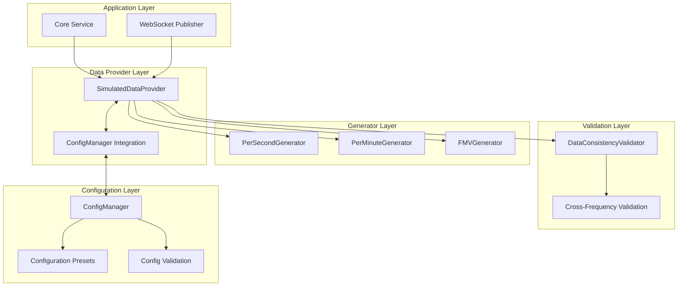
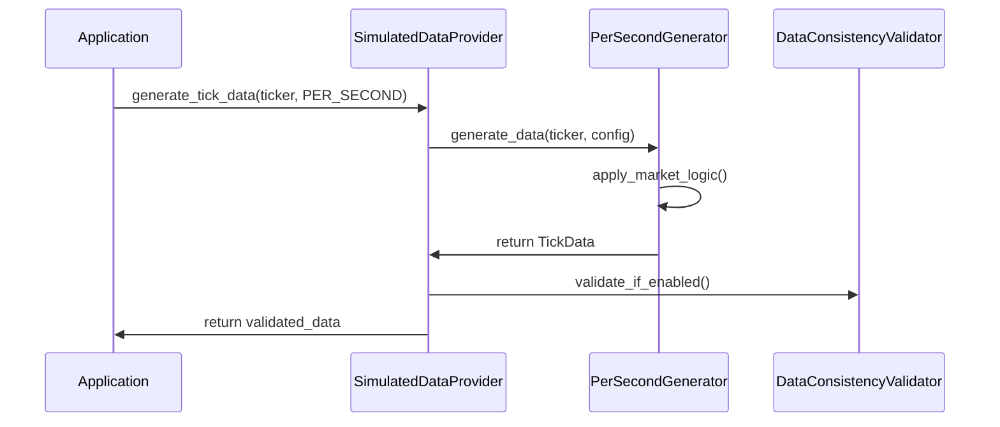
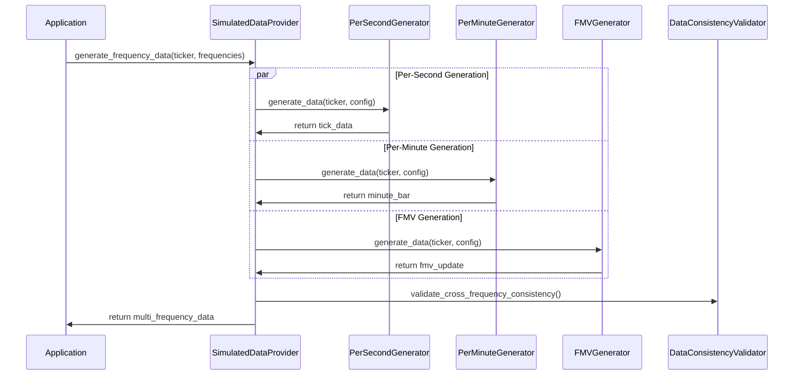
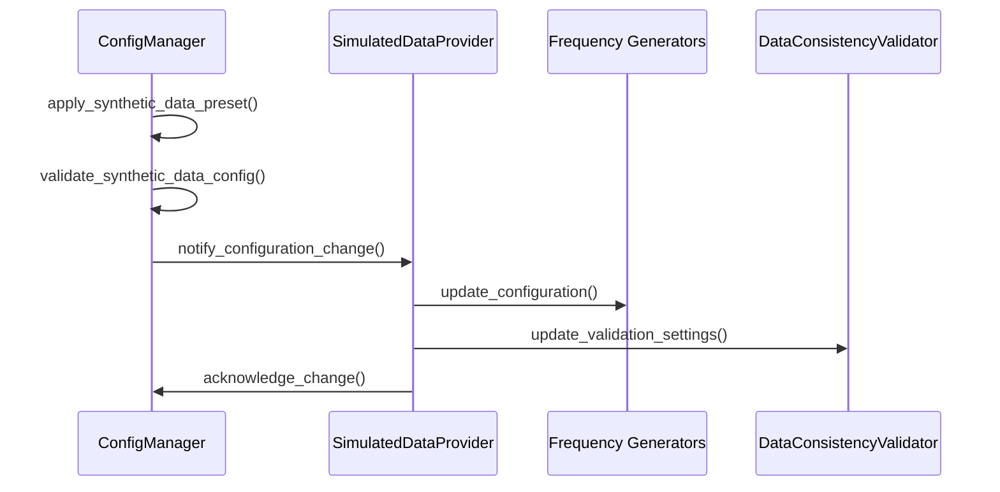

# Multi-Frequency Synthetic Data Architecture

Last edited: August 19, 2025 at 3:45 PM
Sprint: 102 - Synthetic Data Documentation

## Overview

The multi-frequency synthetic data architecture provides a scalable, pluggable system for generating realistic market data across multiple time frequencies. This document details the architectural design, data flow patterns, and technical implementation of the synthetic data generation system.

## Table of Contents

1. [Architecture Overview](#architecture-overview)
2. [Core Design Principles](#core-design-principles)
3. [Component Architecture](#component-architecture)
4. [Data Flow Patterns](#data-flow-patterns)
5. [Frequency-Specific Generation](#frequency-specific-generation)
6. [Validation Architecture](#validation-architecture)
7. [Configuration Integration](#configuration-integration)
8. [Performance Architecture](#performance-architecture)
9. [Extensibility Framework](#extensibility-framework)
10. [Integration Points](#integration-points)

## Architecture Overview

The multi-frequency synthetic data system follows a **pluggable generator architecture** where different frequency-specific generators operate within a unified provider framework.

### High-Level Architecture



### Key Architectural Components

1. **SimulatedDataProvider** - Central orchestrator for multi-frequency generation
2. **Frequency Generators** - Pluggable generators for specific data frequencies
3. **DataConsistencyValidator** - Cross-frequency validation and quality assurance
4. **ConfigManager Integration** - Dynamic configuration management
5. **Type System** - Unified type definitions and protocols

## Core Design Principles

### 1. Pluggable Architecture
- **Protocol-Based Design**: Generators implement `FrequencyGenerator` protocol
- **Runtime Discovery**: Automatic generator registration and initialization
- **Frequency Independence**: Each generator operates independently
- **Extensibility**: New frequencies can be added without core changes

### 2. Mathematical Consistency
- **Cross-Frequency Validation**: Per-minute bars validated against underlying ticks
- **Correlation Enforcement**: FMV maintains realistic correlation with market prices
- **Temporal Alignment**: All frequencies maintain consistent timestamps

### 3. Configuration-Driven Behavior
- **Dynamic Configuration**: Runtime configuration changes without restarts
- **Preset Management**: Predefined configurations for common scenarios
- **Validation Integration**: Configuration validation prevents invalid states

### 4. Performance Optimization
- **Frequency-Specific Optimization**: Each generator optimized for its frequency
- **Validation Toggle**: Optional validation for performance-critical scenarios
- **Memory Management**: Bounded buffers prevent memory leaks

## Component Architecture

### SimulatedDataProvider

The central orchestrator that manages all frequency-specific generators.

```python
class SimulatedDataProvider(DataProvider):
    """Multi-frequency provider with pluggable generators."""
    
    def __init__(self, config: Dict[str, Any]):
        # Multi-frequency architecture
        self._frequency_generators: Dict[DataFrequency, FrequencyGenerator] = {}
        self._active_frequencies = self._determine_active_frequencies(config)
        self._setup_frequency_generators()
        
        # Validation system
        self._validator = None
        if self._enable_validation:
            self._setup_validation_system()
```

**Key Responsibilities:**
- **Generator Management**: Initialize and manage frequency-specific generators
- **Request Routing**: Route generation requests to appropriate generators
- **Configuration Integration**: Apply configuration changes to generators
- **Validation Orchestration**: Coordinate cross-frequency validation
- **Statistics Collection**: Aggregate statistics across all generators

### Frequency Generator Protocol

Defines the interface that all frequency-specific generators must implement.

```python
from typing import Protocol, Dict, Any, Optional
from src.infrastructure.data_sources.synthetic.types import DataFrequency

class FrequencyGenerator(Protocol):
    """Protocol for frequency-specific data generators."""
    
    def generate_data(self, ticker: str, config: Dict[str, Any]) -> Any:
        """Generate data for the specified ticker."""
        ...
    
    def supports_frequency(self, frequency: DataFrequency) -> bool:
        """Check if generator supports the given frequency."""
        ...
    
    def get_generation_stats(self) -> Dict[str, Any]:
        """Get generation statistics for this generator."""
        ...
```

**Protocol Benefits:**
- **Type Safety**: Static type checking ensures correct generator implementation
- **Interface Consistency**: All generators provide consistent API
- **Testing Support**: Easy mocking and testing of individual generators
- **Documentation**: Self-documenting interface contracts

### DataFrequency Enumeration

Centralized frequency type definitions to prevent circular imports.

```python
# src/infrastructure/data_sources/synthetic/types.py
from enum import Enum

class DataFrequency(Enum):
    """Supported data generation frequencies."""
    PER_SECOND = "per_second"
    PER_MINUTE = "per_minute"
    FAIR_VALUE = "fair_value"
```

**Design Rationale:**
- **Separation of Concerns**: Types separated from implementation
- **Import Safety**: Prevents circular import issues
- **Extensibility**: Easy to add new frequencies
- **Type Safety**: Enum provides compile-time type checking

## Data Flow Patterns

### 1. Single-Frequency Generation Flow



### 2. Multi-Frequency Generation Flow



### 3. Configuration Change Flow



## Frequency-Specific Generation

### Per-Second Generator Architecture

Generates individual tick data points with realistic market characteristics.

```python
class PerSecondGenerator:
    """Generates per-second tick data maintaining backward compatibility."""
    
    def __init__(self, config: Dict[str, Any], provider):
        self.config = config
        self.provider = provider  # Reference for market data
        self.generation_count = 0
        
    def generate_data(self, ticker: str, config: Dict[str, Any]) -> TickData:
        """Generate realistic tick data."""
        current_price = self.provider.get_ticker_price(ticker)
        
        # Apply market session effects
        market_status = self.provider.get_market_status()
        volume = self._generate_session_aware_volume(market_status)
        
        # Create comprehensive tick data
        return TickData(
            ticker=ticker,
            price=current_price,
            volume=volume,
            # ... complete tick data structure
        )
```

**Key Features:**
- **Market Session Awareness**: Different behavior for pre-market, regular, after-hours
- **Realistic Price Movement**: Based on configurable variance and activity levels
- **Volume Simulation**: Session-aware volume generation
- **Backward Compatibility**: Maintains existing TickData interface

### Per-Minute Generator Architecture

Aggregates tick-level data into realistic OHLCV bars.

```python
class PerMinuteGenerator:
    """Generates per-minute OHLCV bars from simulated tick paths."""
    
    def generate_data(self, ticker: str, config: Dict[str, Any]) -> Dict[str, Any]:
        """Generate mathematically consistent minute bar."""
        # Generate underlying tick path
        tick_path = self._generate_minute_tick_path(ticker)
        
        # Calculate OHLCV from tick path
        minute_bar = self._aggregate_ticks_to_ohlcv(tick_path)
        
        # Apply market microstructure effects
        minute_bar = self._apply_microstructure_effects(minute_bar)
        
        return self._format_as_polygon_am_event(minute_bar)
```

**Mathematical Consistency:**
- **Tick Path Generation**: Creates realistic intra-minute price movements
- **OHLCV Calculation**: Mathematically derives OHLC from tick sequence
- **Volume Aggregation**: Sums individual tick volumes
- **VWAP Calculation**: Volume-weighted average price from tick data

### FMV Generator Architecture

Generates fair market value updates with sophisticated correlation logic.

```python
class FMVGenerator:
    """Generates Fair Market Value updates with market regime awareness."""
    
    def __init__(self, config: Dict[str, Any], provider):
        # Enhanced correlation tracking
        self._price_history: Dict[str, List[float]] = {}
        self._fmv_history: Dict[str, List[float]] = {}
        self._market_regime: Dict[str, str] = {}
        
    def generate_data(self, ticker: str, config: Dict[str, Any]) -> Dict[str, Any]:
        """Generate regime-aware FMV update."""
        # Detect current market regime
        regime = self._detect_market_regime(ticker)
        
        # Apply regime-specific correlation
        correlation = self._get_regime_adjusted_correlation(ticker, regime)
        
        # Generate correlated FMV value
        fmv_value = self._generate_correlated_fmv(ticker, correlation)
        
        return self._create_fmv_event_structure(ticker, fmv_value)
```

**Advanced Correlation Features:**
- **Market Regime Detection**: Trending, sideways, volatile market identification
- **Dynamic Correlation**: Correlation strength varies by market regime
- **Momentum Persistence**: FMV maintains momentum with configurable decay
- **Lag Modeling**: FMV responds to price changes with realistic lag

## Validation Architecture

### DataConsistencyValidator

Ensures mathematical consistency across all frequency data streams.

```python
class DataConsistencyValidator:
    """Validates consistency across multi-frequency data streams."""
    
    def __init__(self, config: Dict[str, Any]):
        # Data collection windows
        self._tick_buffers: Dict[str, List[TickData]] = {}
        self._minute_bars: Dict[str, List[Dict[str, Any]]] = {}
        self._fmv_updates: Dict[str, List[Dict[str, Any]]] = {}
        
    def validate_minute_bar_consistency(
        self, 
        ticker: str, 
        minute_bar: Dict[str, Any]
    ) -> ValidationResult:
        """Validate minute bar against underlying tick data."""
        # Find corresponding tick window
        tick_window = self._get_tick_window_for_bar(ticker, minute_bar)
        
        # Validate OHLC consistency
        ohlc_valid = self._validate_ohlc_consistency(minute_bar, tick_window)
        
        # Validate volume consistency
        volume_valid = self._validate_volume_consistency(minute_bar, tick_window)
        
        # Validate VWAP consistency
        vwap_valid = self._validate_vwap_consistency(minute_bar, tick_window)
        
        return ValidationResult(
            is_valid=ohlc_valid and volume_valid and vwap_valid,
            # ... detailed validation results
        )
```

**Validation Capabilities:**
- **Cross-Frequency Consistency**: Minute bars validated against tick data
- **Mathematical Accuracy**: OHLCV calculations verified
- **Correlation Validation**: FMV correlation strength monitoring
- **Configurable Tolerances**: Adjustable validation thresholds
- **Performance Monitoring**: Validation performance impact tracking

### Validation Result Structure

```python
@dataclass
class ValidationResult:
    """Result of data consistency validation."""
    is_valid: bool
    errors: List[str]
    warnings: List[str]
    metrics: Dict[str, float]
    validation_time: float
```

## Configuration Integration

### ConfigManager Extensions

The system extends the existing ConfigManager with synthetic data-specific methods.

```python
class ConfigManager:
    # Existing ConfigManager functionality...
    
    def get_synthetic_data_config(self) -> Dict[str, Any]:
        """Get complete synthetic data configuration."""
        # Aggregates all synthetic data settings
        
    def get_synthetic_data_presets(self) -> Dict[str, Dict[str, Any]]:
        """Get predefined configuration presets."""
        # Returns preset configurations
        
    def apply_synthetic_data_preset(self, preset_name: str) -> bool:
        """Apply a configuration preset."""
        # Validates and applies preset
        
    def validate_synthetic_data_config(self) -> Tuple[bool, List[str]]:
        """Validate synthetic data configuration consistency."""
        # Comprehensive configuration validation
```

**Configuration Architecture Benefits:**
- **Centralized Management**: All synthetic data configuration in one place
- **Dynamic Updates**: Runtime configuration changes without service restart
- **Preset Management**: Quick switching between common configurations
- **Validation Integration**: Prevents invalid configurations

## Performance Architecture

### Generator Performance Optimization

Each generator is optimized for its specific frequency characteristics:

#### Per-Second Generator Optimizations
- **Rate Limiting**: Prevents excessive generation requests
- **Price Caching**: Caches calculated prices to reduce computation
- **Memory Pooling**: Reuses TickData objects where possible

#### Per-Minute Generator Optimizations
- **Tick Path Caching**: Caches generated tick paths for reuse
- **Lazy OHLCV Calculation**: Defers calculation until requested
- **Buffer Management**: Bounded buffers prevent memory growth

#### FMV Generator Optimizations
- **History Pruning**: Automatically trims old price history
- **Regime Caching**: Caches market regime detection results
- **Correlation Batching**: Batch correlation calculations

### Validation Performance Architecture

```python
class DataConsistencyValidator:
    def __init__(self, config: Dict[str, Any]):
        # Performance optimizations
        self._enable_validation = config.get('ENABLE_SYNTHETIC_DATA_VALIDATION', True)
        self._validation_cache = {}  # Cache validation results
        self._async_validation = config.get('ASYNC_VALIDATION', False)
        
    def _validate_with_cache(self, key: str, validation_func: Callable):
        """Use cached validation results when possible."""
        if key in self._validation_cache:
            return self._validation_cache[key]
        
        result = validation_func()
        self._validation_cache[key] = result
        return result
```

**Performance Features:**
- **Optional Validation**: Can be disabled for performance-critical scenarios
- **Validation Caching**: Avoid re-validating identical data
- **Asynchronous Validation**: Non-blocking validation for high-frequency scenarios
- **Bounded Buffers**: Prevent unbounded memory growth

## Extensibility Framework

### Adding New Frequencies

The architecture supports easy addition of new frequency types:

1. **Define New Frequency**:
```python
# Add to DataFrequency enum
class DataFrequency(Enum):
    PER_SECOND = "per_second"
    PER_MINUTE = "per_minute"
    FAIR_VALUE = "fair_value"
    HOURLY = "hourly"  # New frequency
```

2. **Implement Generator**:
```python
class HourlyGenerator:
    """Generates hourly aggregate data."""
    
    def generate_data(self, ticker: str, config: Dict[str, Any]) -> Dict[str, Any]:
        # Implementation for hourly data generation
        pass
    
    def supports_frequency(self, frequency: DataFrequency) -> bool:
        return frequency == DataFrequency.HOURLY
```

3. **Register Generator**:
```python
# SimulatedDataProvider automatically discovers and registers new generators
def _setup_frequency_generators(self):
    # Existing generators...
    elif frequency == DataFrequency.HOURLY:
        from .generators.hourly_generator import HourlyGenerator
        self._frequency_generators[frequency] = HourlyGenerator(self.config, self)
```

### Custom Validation Rules

The validation system supports custom validation rules:

```python
class CustomValidator:
    def validate_hourly_consistency(
        self, 
        ticker: str, 
        hourly_data: Dict[str, Any]
    ) -> ValidationResult:
        """Custom validation for hourly data."""
        # Implementation of hourly-specific validation
        pass
```

## Integration Points

### Core Service Integration

The synthetic data system integrates seamlessly with TickStock's core services:

```python
# core_service.py integration
class CoreService:
    def __init__(self):
        self.data_provider = self._initialize_data_provider()
    
    def _initialize_data_provider(self):
        if self.config.get('USE_SYNTHETIC_DATA', False):
            return SimulatedDataProvider(self.config)
        else:
            return PolygonDataProvider(self.config)
```

### WebSocket Publisher Integration

Multi-frequency data flows through the existing WebSocket infrastructure:

```python
# websocket_publisher.py integration
class WebSocketPublisher:
    def emit_frequency_data(self, ticker: str, frequencies: List[DataFrequency]):
        """Emit data for multiple frequencies."""
        for frequency in frequencies:
            data = self.data_provider.generate_frequency_data(ticker, frequency)
            if data:
                self._emit_to_subscribers(ticker, frequency, data)
```

### Event Processing Integration

Generated data feeds into existing event detection pipelines:

```python
# event_processor.py integration
class EventProcessor:
    def process_synthetic_data(self, data: Any, frequency: DataFrequency):
        """Process synthetic data through existing event detection."""
        if frequency == DataFrequency.PER_SECOND:
            return self._process_tick_data(data)
        elif frequency == DataFrequency.PER_MINUTE:
            return self._process_minute_data(data)
        # ... handle other frequencies
```

## Architectural Patterns Summary

### Key Design Patterns Used

1. **Strategy Pattern**: Different generators for different frequencies
2. **Protocol/Interface Pattern**: FrequencyGenerator protocol ensures consistency
3. **Factory Pattern**: Provider creates and manages generators
4. **Observer Pattern**: Configuration change notifications
5. **Validation Chain**: Cascading validation across multiple layers
6. **Builder Pattern**: Complex configuration building through presets

### SOLID Principles Adherence

- **Single Responsibility**: Each generator handles one frequency type
- **Open/Closed**: New frequencies can be added without modifying existing code
- **Liskov Substitution**: All generators are interchangeable through protocol
- **Interface Segregation**: FrequencyGenerator protocol is minimal and focused
- **Dependency Inversion**: Provider depends on abstractions, not concrete generators

### Performance Characteristics

| Component | Throughput Target | Memory Usage | Latency Target |
|-----------|------------------|--------------|----------------|
| PerSecondGenerator | >1000 gen/sec | <10MB | <1ms per generation |
| PerMinuteGenerator | >100 gen/sec | <50MB | <10ms per generation |
| FMVGenerator | >50 gen/sec | <20MB | <20ms per generation |
| DataConsistencyValidator | >500 validations/sec | <30MB | <5ms per validation |

This architecture provides a robust, extensible, and performant foundation for multi-frequency synthetic data generation while maintaining mathematical consistency and integration with TickStock's existing infrastructure.