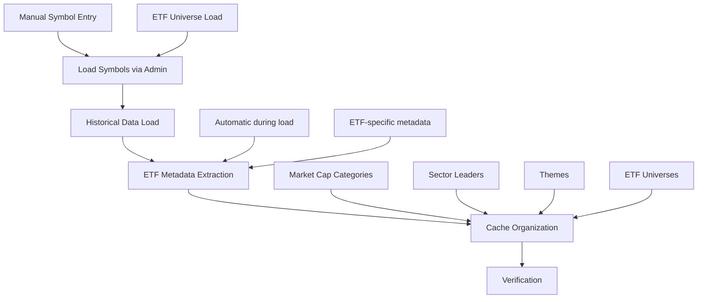

# Historical Data Loading and Cache Organization Process Guide

**Document Version**: 1.0  
**Created**: 2025-09-02  
**Sprint**: 14 Complete Implementation  

## Overview

This guide provides a complete workflow for loading historical data and organizing cache entries in TickStock. The process ensures proper data flow from symbols → historical data → organized cache entries.

## Process Flow



## Step 1: Load Symbols and Historical Data

### Via Admin Interface
1. **Access Admin Panel**
   - Navigate to `/admin/historical-data`
   - Login with admin credentials

2. **Configure Load Job**
   - **Load Type**: Choose "Stock Universe" or "Specific Symbols"
   - **Universe**: Select from available universes (Top 50, S&P 500, etc.)
   - **Symbols**: For specific symbols, enter comma-separated list (e.g., `SPY,QQQ,VTI`)
   - **Years of Data**: Select timeframe (1 month to 5 years)
   - **Timespan**: Daily (recommended) or 1-Minute
   - **Priority**: Normal, High, or Low

3. **Start Load Job**
   - Click **"Start Load Job"**
   - Monitor progress in Active Jobs section
   - View real-time log messages

### What Happens During Load
- **Symbol Creation**: `ensure_symbol_exists()` creates symbol records with metadata
- **ETF Detection**: Automatically detects ETF symbols and extracts ETF-specific metadata
- **Data Loading**: Fetches historical OHLCV data from Polygon.io
- **Database Storage**: Saves to `ohlcv_daily` or `ohlcv_minute` tables

## Step 2: Organize Cache Entries

### Via Admin Interface (Recommended)
1. **Navigate to Cache Organization**
   - On the same Admin Historical Data page
   - Scroll to **"Cache Organization"** section

2. **Choose Rebuild Mode**
   - **Unchecked** (Replace Mode): Deletes and rebuilds all stock/ETF entries
     - Preserves `app_settings` and other non-stock entries
     - Recommended for clean, consistent organization
   - **Checked** (Append Mode): Preserves existing entries, adds new ones
     - Use when you want to keep custom cache entries

3. **Execute Cache Rebuild**
   - Click **"Update and Organize Cache"**
   - Confirm the operation
   - View detailed results in flash messages

### What Gets Created
The cache rebuild creates the following organized entries:

#### Market Cap Categories
```
stock_universe | market_cap | mega_cap     # $200B+ stocks
stock_universe | market_cap | large_cap    # $10B-$200B stocks  
stock_universe | market_cap | mid_cap      # $2B-$10B stocks
stock_universe | market_cap | small_cap    # $300M-$2B stocks
stock_universe | market_cap | micro_cap    # Under $300M stocks
```

#### Sector Leaders (Top 10 per sector)
```
stock_universe | sector_leaders | top_10_technology
stock_universe | sector_leaders | top_10_healthcare
stock_universe | sector_leaders | top_10_financial_services
... (one per sector)
```

#### Market Leaders
```
stock_universe | market_leaders | top_10_stocks
stock_universe | market_leaders | top_50
stock_universe | market_leaders | top_100
stock_universe | market_leaders | top_250  
stock_universe | market_leaders | top_500
```

#### Themes (Dual Entries)
```
themes         | AI          | list        # Simple ticker array
stock_universe | themes      | ai          # Same data, different location
themes         | Biotech     | list
stock_universe | themes      | biotech
... (AI, Biotech, Cloud, Crypto, Cybersecurity, EV, Fintech, etc.)
```

#### Industry Groups
```
stock_universe | industry | banks
stock_universe | industry | insurance
stock_universe | industry | software
stock_universe | industry | retail
```

#### ETF Universes
```
etf_universe | Broad Market ETFs | etf_broad_market
etf_universe | Sector ETFs      | etf_sectors
etf_universe | Growth ETFs      | etf_growth
etf_universe | Value ETFs       | etf_value
etf_universe | Technology ETFs  | etf_technology
etf_universe | Bond ETFs        | etf_bonds
etf_universe | Commodity ETFs   | etf_commodities
```

#### Complete Universes (Performance Optimized)
```
stock_universe | complete | top_1000    # Top 1000 stocks with full metadata
stock_universe | complete | all_stocks  # All stocks as ticker array only
etf_universe   | complete | top_100     # Top 100 ETFs with full metadata  
etf_universe   | complete | all_etfs    # All ETFs as ticker array only
```

#### Statistics Summary
```
stock_stats | universe | summary    # Portfolio overview with totals
```

## Step 3: Verification

### Via Analysis Script
```bash
# Run analysis to verify cache structure
python scripts/dev_tools/maint_read_stock_cache_entries.py
```

The analysis script shows:
- Entry counts by type/name/key
- Data freshness timestamps  
- Comparison with symbols table
- Recommendations for improvements

### Via Database Queries
```sql
-- Check cache entry counts
SELECT type, name, COUNT(*) as count
FROM cache_entries 
GROUP BY type, name 
ORDER BY type, name;

-- Verify stock universe entries
SELECT key, jsonb_extract_path_text(value::jsonb, 'count') as stock_count
FROM cache_entries 
WHERE type = 'stock_universe' AND name = 'market_cap';

-- Check theme entries
SELECT name, jsonb_array_length(value::jsonb) as ticker_count
FROM cache_entries
WHERE type = 'themes';
```

## Troubleshooting

### Common Issues

#### Historical Load Failures
- **API Rate Limits**: Wait and retry (12-second intervals enforced)
- **Symbol Not Found**: Check symbol validity on Polygon.io
- **Database Connection**: Verify DATABASE_URI in .env file

#### Cache Rebuild Failures  
- **Database Connection**: Ensure proper connection to PostgreSQL
- **Missing Symbols**: Run historical load first to populate symbols table
- **Permissions**: Verify database user has INSERT/UPDATE/DELETE permissions

#### ETF Metadata Missing
- **AUM/Expense Ratio NULL**: Normal - Polygon.io doesn't provide these for many ETFs
- **ETF Type Detection**: Based on symbol type in Polygon.io API response

### Recovery Procedures

#### Incomplete Cache Rebuild
1. Check error messages in admin flash messages
2. Run analysis script to see what was created
3. Re-run cache rebuild (safe to repeat)

#### Missing ETF Data
1. Verify ETF symbols loaded in symbols table: `SELECT * FROM symbols WHERE type = 'ETF'`
2. Check ETF metadata: `SELECT symbol, etf_type, issuer FROM symbols WHERE type = 'ETF'`
3. Re-run historical load for specific ETF symbols if needed

## Performance Considerations

### Expected Execution Times
- **Historical Load**: 1-5 minutes per 50 symbols (daily data, 1 year)
- **Cache Rebuild**: 10-30 seconds for typical symbol counts (<5000 symbols)
- **Analysis Script**: 2-5 seconds

### Optimization Tips
- Use **daily data** for most use cases (minute data generates massive datasets)
- Limit historical data to **1-2 years** for initial loads
- Run cache rebuild **after bulk symbol loads** rather than after each symbol

## Scheduling and Maintenance

### Recommended Schedule
1. **Weekly**: Load new symbols and refresh existing data
2. **After new symbol loads**: Run cache rebuild to organize new data  
3. **Monthly**: Full cache rebuild to clean up and reorganize
4. **Quarterly**: Review and update theme definitions

### Integration with Application
- **Cache Loading**: Application loads cache entries at startup via `CacheControl`
- **Real-time Updates**: Redis notifications sent to connected WebSocket clients
- **Performance**: Cache entries optimized for <50ms query times

## Advanced Usage

### Command Line Tools
```bash
# Direct cache rebuild (bypasses admin interface)
python scripts/maintenance/run_cache_synchronization.py

# Preserve existing entries
python scripts/maintenance/run_cache_synchronization.py --no-delete

# Verbose logging for debugging
python scripts/maintenance/run_cache_synchronization.py --verbose
```

### Custom Theme Definitions
Edit `src/core/services/cache_entries_synchronizer.py` to modify theme definitions:
```python
self.theme_definitions = {
    'ai': ['NVDA', 'GOOGL', 'MSFT', 'AMD', 'PLTR'],
    'custom_theme': ['AAPL', 'MSFT', 'GOOGL'],  # Add custom themes
    # ...
}
```

### Redis Notifications
Cache rebuilds publish notifications to:
- `cache_updates` - General cache update events
- `universe_updates` - Universe membership changes  
- `admin_notifications` - Administrative alerts

## Success Criteria

### Verification Checklist
- [ ] Historical data loads successfully for target symbols
- [ ] ETF symbols have proper `etf_type`, `issuer` metadata populated  
- [ ] Cache entries organized into all expected categories
- [ ] Complete universes have proper performance optimization (ticker arrays vs full objects)
- [ ] No app_settings entries affected by cache rebuild
- [ ] Analysis script shows recent timestamps and proper organization
- [ ] Application startup loads cache entries without errors

### Quality Metrics
- **Data Coverage**: 90%+ of loaded symbols appear in relevant cache categories
- **Performance**: Cache rebuild completes in <60 seconds
- **Accuracy**: Market cap categories match actual market cap ranges
- **Completeness**: All major sectors represented in sector leaders