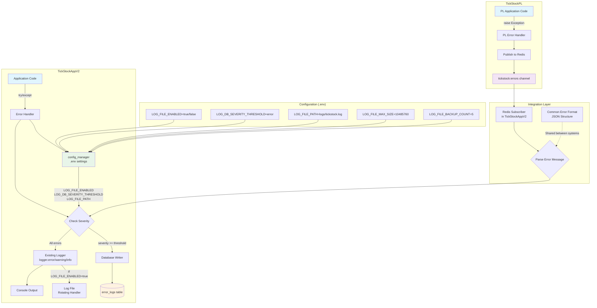

# TickStockAppV2 Error & Exception Management Strategy

## Document Overview
**Created**: 2025-09-25
**Status**: ACTIVE - SIMPLIFIED
**Purpose**: Define a simple, effective error handling strategy that leverages existing infrastructure
**Scope**: TickStockAppV2 and TickStockPL integration

## Core Philosophy
Keep it simple. Enhance existing logger. Config-driven thresholds. Consistent error handling across both systems.

## Architecture Overview



## Key Design Principles

1. **Use Existing Logger** - Enhance current logging, don't replace it
2. **Config-Driven** - All settings in .env, managed by config_manager
3. **Simple Severity Check** - One threshold determines database storage
4. **Consistent Format** - Same error structure for both systems
5. **Redis Integration** - TickStockPL publishes, TickStockAppV2 subscribes
6. **No New Projects** - Keep implementation lightweight and focused

## Implementation Plan

### Phase 1: Core Infrastructure (Week 1)

#### 1.1 Environment Configuration
Add to `.env`:
```bash
# File Logging Configuration
LOG_FILE_ENABLED=true
LOG_FILE_PATH=logs/tickstock.log
LOG_FILE_MAX_SIZE=10485760  # 10MB
LOG_FILE_BACKUP_COUNT=5

# Database Logging Configuration
LOG_DB_ENABLED=true
LOG_DB_SEVERITY_THRESHOLD=error  # critical|error|warning|info|debug

# Redis Error Channel
REDIS_ERROR_CHANNEL=tickstock:errors
```

#### 1.2 Config Manager Enhancement
Update `src/core/services/config_manager.py`:
```python
class LoggingConfig(BaseSettings):
    """Logging configuration from environment"""

    # File logging
    log_file_enabled: bool = Field(default=False, env='LOG_FILE_ENABLED')
    log_file_path: str = Field(default='logs/tickstock.log', env='LOG_FILE_PATH')
    log_file_max_size: int = Field(default=10485760, env='LOG_FILE_MAX_SIZE')
    log_file_backup_count: int = Field(default=5, env='LOG_FILE_BACKUP_COUNT')

    # Database logging
    log_db_enabled: bool = Field(default=False, env='LOG_DB_ENABLED')
    log_db_severity_threshold: str = Field(default='error', env='LOG_DB_SEVERITY_THRESHOLD')

    # Redis integration
    redis_error_channel: str = Field(default='tickstock:errors', env='REDIS_ERROR_CHANNEL')
```

#### 1.3 Database Schema
Create `scripts/database/create_error_logs_table.sql`:
```sql
CREATE TABLE IF NOT EXISTS error_logs (
    id SERIAL PRIMARY KEY,
    error_id VARCHAR(255) UNIQUE NOT NULL,
    source VARCHAR(50) NOT NULL,  -- 'TickStockAppV2' or 'TickStockPL'
    severity VARCHAR(20) NOT NULL,
    category VARCHAR(50),
    message TEXT NOT NULL,
    component VARCHAR(100),
    traceback TEXT,
    context JSONB,
    timestamp TIMESTAMPTZ NOT NULL,
    created_at TIMESTAMPTZ DEFAULT NOW()
);

-- Indexes for performance
CREATE INDEX idx_error_logs_timestamp ON error_logs(timestamp DESC);
CREATE INDEX idx_error_logs_severity ON error_logs(severity);
CREATE INDEX idx_error_logs_source ON error_logs(source);
CREATE INDEX idx_error_logs_category ON error_logs(category);

-- Grant permissions
GRANT ALL ON error_logs TO app_readwrite;
```

### Phase 2: Logger Enhancement (Week 1)

#### 2.1 Enhanced Logger Class
Create `src/core/services/enhanced_logger.py`:
```python
import logging
from logging.handlers import RotatingFileHandler
import json
import uuid
from datetime import datetime
from typing import Dict, Any, Optional

class EnhancedLogger:
    """Enhanced logger with file and database capabilities"""

    SEVERITY_LEVELS = {
        'critical': 50,
        'error': 40,
        'warning': 30,
        'info': 20,
        'debug': 10
    }

    def __init__(self, config: LoggingConfig, db_connection=None):
        self.config = config
        self.db = db_connection
        self.logger = logging.getLogger(__name__)

        # Setup file handler if enabled
        if config.log_file_enabled:
            self._setup_file_handler()

    def _setup_file_handler(self):
        """Configure rotating file handler"""
        os.makedirs(os.path.dirname(self.config.log_file_path), exist_ok=True)

        handler = RotatingFileHandler(
            filename=self.config.log_file_path,
            maxBytes=self.config.log_file_max_size,
            backupCount=self.config.log_file_backup_count
        )

        formatter = logging.Formatter(
            '%(asctime)s - %(name)s - %(levelname)s - %(message)s'
        )
        handler.setFormatter(formatter)
        self.logger.addHandler(handler)

    def log_error(self, severity: str, message: str,
                  category: str = None, component: str = None,
                  context: Dict[str, Any] = None, traceback: str = None):
        """Log error with optional database storage"""

        # Always log to standard logger
        level = self.SEVERITY_LEVELS.get(severity, 20)
        self.logger.log(level, message, extra={'context': context})

        # Check if should store in database
        if self._should_store_in_db(severity):
            self._store_in_database(
                severity=severity,
                message=message,
                category=category,
                component=component,
                context=context,
                traceback=traceback
            )

    def _should_store_in_db(self, severity: str) -> bool:
        """Check if severity meets threshold for database storage"""
        if not self.config.log_db_enabled or not self.db:
            return False

        threshold_level = self.SEVERITY_LEVELS.get(
            self.config.log_db_severity_threshold, 40
        )
        current_level = self.SEVERITY_LEVELS.get(severity, 0)

        return current_level >= threshold_level

    def _store_in_database(self, **kwargs):
        """Store error in database"""
        try:
            query = """
                INSERT INTO error_logs
                (error_id, source, severity, category, message,
                 component, traceback, context, timestamp)
                VALUES (%s, %s, %s, %s, %s, %s, %s, %s, %s)
            """

            values = (
                str(uuid.uuid4()),
                'TickStockAppV2',
                kwargs.get('severity'),
                kwargs.get('category'),
                kwargs.get('message'),
                kwargs.get('component'),
                kwargs.get('traceback'),
                json.dumps(kwargs.get('context', {})),
                datetime.utcnow()
            )

            with self.db.get_connection() as conn:
                conn.execute(query, values)
                conn.commit()

        except Exception as e:
            # Log database error but don't fail the application
            self.logger.error(f"Failed to store error in database: {e}")
```

#### 2.2 Common Error Format
Define in `src/core/models/error_models.py`:
```python
from pydantic import BaseModel
from typing import Optional, Dict, Any
from datetime import datetime

class ErrorMessage(BaseModel):
    """Standard error format for both systems"""

    error_id: str
    source: str  # 'TickStockAppV2' or 'TickStockPL'
    severity: str  # critical|error|warning|info|debug
    category: Optional[str] = None  # pattern|database|network|validation|etc
    message: str
    component: Optional[str] = None
    traceback: Optional[str] = None
    context: Optional[Dict[str, Any]] = None
    timestamp: datetime

    def to_json(self) -> str:
        """Convert to JSON for Redis publishing"""
        return self.model_dump_json()

    @classmethod
    def from_json(cls, json_str: str) -> 'ErrorMessage':
        """Create from JSON received via Redis"""
        return cls.model_validate_json(json_str)
```

### Phase 3: Redis Integration (Week 2)

#### 3.1 Error Subscriber Service
Create `src/core/services/error_subscriber.py`:
```python
import redis
import threading
import json
from typing import Callable

class ErrorSubscriber:
    """Subscribe to TickStockPL errors via Redis"""

    def __init__(self, redis_client: redis.Redis,
                 enhanced_logger: EnhancedLogger,
                 config: LoggingConfig):
        self.redis_client = redis_client
        self.logger = enhanced_logger
        self.config = config
        self.running = False
        self.thread = None

    def start(self):
        """Start listening for errors"""
        self.running = True
        self.thread = threading.Thread(target=self._listen, daemon=True)
        self.thread.start()

    def _listen(self):
        """Listen for error messages"""
        pubsub = self.redis_client.pubsub()
        pubsub.subscribe(self.config.redis_error_channel)

        for message in pubsub.listen():
            if not self.running:
                break

            if message['type'] == 'message':
                try:
                    # Parse error message
                    error_msg = ErrorMessage.from_json(message['data'])

                    # Log using enhanced logger
                    self.logger.log_error(
                        severity=error_msg.severity,
                        message=f"[{error_msg.source}] {error_msg.message}",
                        category=error_msg.category,
                        component=error_msg.component,
                        context=error_msg.context,
                        traceback=error_msg.traceback
                    )

                except Exception as e:
                    self.logger.logger.error(f"Failed to process error from Redis: {e}")

    def stop(self):
        """Stop listening"""
        self.running = False
```

### Phase 4: Integration with Existing Code (Week 2)

#### 4.1 Update Application Initialization
In `src/app.py`:
```python
def initialize_error_handling(config):
    """Initialize enhanced error handling"""
    global enhanced_logger, error_subscriber

    # Create enhanced logger
    logging_config = LoggingConfig()
    db_connection = get_db_connection() if logging_config.log_db_enabled else None
    enhanced_logger = EnhancedLogger(logging_config, db_connection)

    # Start Redis error subscriber if Redis is available
    if redis_client and logging_config.redis_error_channel:
        error_subscriber = ErrorSubscriber(redis_client, enhanced_logger, logging_config)
        error_subscriber.start()
        logger.info("Error subscriber started for TickStockPL integration")

    return enhanced_logger
```

#### 4.2 Error Handling Pattern
Standard pattern for all try/except blocks:
```python
try:
    # Operation code
    result = perform_operation()
except SpecificException as e:
    # Use enhanced logger
    enhanced_logger.log_error(
        severity='error',
        message=f"Operation failed: {str(e)}",
        category='pattern',  # or appropriate category
        component='PatternDetector',
        context={
            'symbol': symbol,
            'user_id': user_id,
            'operation': 'detect_pattern'
        },
        traceback=traceback.format_exc() if debug_mode else None
    )
    # Handle error appropriately
    return fallback_value
```

## TickStockPL Integration Instructions

### For TickStockPL Developer
Create separate document `tickstockpl_error_integration.md`:

1. **Implement error handler that publishes to Redis**
2. **Use same ErrorMessage format**
3. **Set source='TickStockPL'**
4. **Publish to 'tickstock:errors' channel**
5. **Include proper severity levels**

Example for TickStockPL:
```python
def handle_error(exception, severity='error', category=None, context=None):
    """Handle errors and publish to Redis"""
    error_msg = ErrorMessage(
        error_id=str(uuid.uuid4()),
        source='TickStockPL',
        severity=severity,
        category=category,
        message=str(exception),
        component='PatternEngine',
        traceback=traceback.format_exc(),
        context=context,
        timestamp=datetime.utcnow()
    )

    # Publish to Redis
    redis_client.publish('tickstock:errors', error_msg.to_json())
```

## Testing Strategy

### 1. Unit Tests
- Test severity threshold logic
- Test database storage conditions
- Test error message parsing
- Test file rotation

### 2. Integration Tests
- Test Redis subscription
- Test cross-system error flow
- Test database persistence
- Test configuration changes

### 3. Manual Testing
```python
# Test script to generate errors
def test_error_handling():
    # Test different severities
    for severity in ['debug', 'info', 'warning', 'error', 'critical']:
        enhanced_logger.log_error(
            severity=severity,
            message=f"Test {severity} message",
            category='test',
            component='TestComponent'
        )

    # Check file exists
    assert os.path.exists('logs/tickstock.log')

    # Check database entries (for error and above)
    # Query error_logs table
```

## Success Metrics

1. **All errors logged to file** when LOG_FILE_ENABLED=true
2. **Configurable database storage** based on severity threshold
3. **Zero lost errors** from TickStockPL integration
4. **<100ms processing time** for error handling
5. **No impact on main application performance**

## Rollout Plan

### Week 1: TickStockAppV2 Implementation
- Day 1-2: Database schema and config setup
- Day 3-4: Enhanced logger implementation
- Day 5: Testing and validation

### Week 2: Integration
- Day 1-2: Redis subscriber implementation
- Day 3: Integration with existing code
- Day 4: Testing cross-system flow
- Day 5: Documentation for TickStockPL

### Future Enhancements (Not Sprint 32)
- Admin dashboard for error viewing
- Error analytics and trends
- Alert notifications
- Auto-recovery mechanisms

---

**This simplified strategy focuses on practical implementation using existing infrastructure, with clear separation between current sprint goals and future enhancements.**